Most developers these days have heard of machine learning, but when trying to find an 'easy' way into this technique, most people find themselves getting scared off by the abstractness of the concept of *Machine Learning* and terms as [*regression*](http://en.wikipedia.org/wiki/Regression_analysis), [*unsupervised learning*](http://en.wikipedia.org/wiki/Unsupervised_learning), [*Probability Density Function*](http://en.wikipedia.org/wiki/Probability_density_function) and many other definitions. If one switches to books there are books such as [*An Introduction to Statistical Learning with Applications in R*](http://www-bcf.usc.edu/~gareth/ISL/) and [*Machine Learning for Hackers*](http://shop.oreilly.com/product/0636920018483.do) who use programming language [R](http://www.r-project.org) for their examples.

However R is not really a programming language in which one writes programs for everyday use such as is done with for example Java, C#, Scala etc. This is why in this blog machine learning will be introduced using [Smile](https://github.com/haifengl/smile), a machine learning library that can be used both in Java and Scala. These are languages that most developers have seen at least once during their study or career. 

The first section **['The global idea of machine learning'](#the-global-idea-of-machine-learning)** contains all important concepts and notions you need to know about to get started with the practical examples that are described in the section ['Practical Examples'](#practical-examples). The section practical examples is inspired by the examples from the book [*Machine Learning for Hackers*](http://shop.oreilly.com/product/0636920018483.do). Additionally the book [Machine Learning in Action](http://www.manning.com/pharrington/) was used for validation purposes.

The second section **[Practical examples](#practical-examples)** contains examples for various machine learning (ML) applications, with [Smile](https://github.com/haifengl/smile) as ML library. 

Note that in this blog, 'new' definitions are hyperlinked such that if you want, you **can** read more regarding that specific topic, but you are not obliged to do this in order to be able to work through the examples. 

As final note I'd like to thank the following people:

* [Haifeng Li](https://www.linkedin.com/in/haifengli) for his support and writing the awesome and free to use library [Smile](https://github.com/haifengl/smile).
* [Erik Meijer](https://www.linkedin.com/profile/view?id=1490860) for all suggestions and supervision of the process of writing this blog.
* [Richard van Heest](https://www.linkedin.com/profile/view?id=138460950) for his feedback and co-reading the blog.
* [Lars Willems](https://www.linkedin.com/profile/view?id=355522383) for his feedback and co-reading the blog.

#The global idea of machine learning
You probably have heard about Machine learning as a concept one time or another. However, if you would have to explain what machine learning is to another person, how would you do this? Think about this for a second before reading the rest of this section.

Machine learning is explained in many ways, some more accurate than others, however there is a lot of inconsistency in its definition. Some say machine learning is generating a static model based on historical data, which then allows you to predict for future data. Others say it's a dynamic model that keeps on changing as more data is added over time.

I agree more with the dynamic definition but due to certain limitations we explain the static model method in the examples. However, we do explain how the dynamic principle would work in the subsection [Dynamic machine learning](#dynamic-machine-learning).

The upcoming subsections explain commonly used definitions and notions in the machine learning field. We advise you to read through these before starting the practical examples.

##Features
A *feature* is a property on which a [model](#model) is trained. Say for example that you classify emails as spam/ham based on the frequency of the word 'Buy' and 'Money'. Then these words are features, or part of a feature if you would combine it with more words. If you would use machine learning to predict whether one is a friend of yours, the amount of 'common' friends could be a feature. Note that in the field, sometimes features are also referred to as *attributes*.

##Model
When one talks about machine learning, often the term *model* is mentioned. The model is the result of any machine learning method and the algorithm used within this method. This model can be used to make predictions in [supervised](#supervised-learning), or to retrieve clusterings in [unsupervised learning](#unsupervised-learning). Chances are high that you will encounter the terms **online** and **offline** training of a model in the field. The idea behind online training is that you add training data to an already existing model, whereas with offline training you generate a new model from scratch. For performance reasons, online training would be the most preferable method. However for some algorithms this is not possible.

##Learning methods
In the field of machine learning there are two leading ways of learning, namely [Supervised learning](#supervised-learning) and [Unsupervised learning](#unsupervised-learning). A brief introduction is necessary when you want to use Machine learning in your applications, as picking the right machine learning approach and algorithm is an important but sometimes also a little tedious process.

###Supervised learning
In supervised learning you define explicitly what features you want to use, and what output you expect. An example is predicting gender based on height and weight, which is known as a [Classification](#classification) problem. Additionally you can also predict absolute values with [Regression](#regression). An example of regression with the same data would be predicting one's length based on gender and weight. Some supervised algorithms can only be used for either classification or regression, such as [K-NN](#labeling-isps-based-on-their-downupload-speed-k-nn-using-smile-in-scala). However there also exists algorithms such as [Support Vector Machines](#using-support-vector-machines-svms) which can be used for both purposes. 

####Classification
The problem of classification within the domain of Supervised learning is relatively simple. Given a set of labels, and some data that already received the correct labels, we want to be able to *predict* labels for new data that we did not label yet. However, before thinking of your data as a classification problem, you should look at what the data looks like. If there is a clear structure in the data such that you can easily draw a regression line it might be better to use a [regression](#regression) algorithm instead. Given the data does not fit to a regression line, or when performance becomes an issue, classification is a good alternative.

An example of a classification problem would be to classify emails as ham or spam based on their content. Given a training set in which emails are labeled ham or spam, a classification algorithm can be used to train a [Model](#model). This model can then be used to predict for future emails whether they are ham or spam. A typical example of a classification algorithm is the [K-NN algorithm](#labeling-isps-based-on-their-downupload-speed-k-nn-using-smile-in-scala). Another commonly used example of a classification problem is [Classifying email as spam or ham](#classifying-email-as-spam-or-ham-naive-bayes) which is also one of the examples written on this blog.

####Regression
Regression is a lot stronger in comparison to [classification](#classification). This is because in regression you are predicting actual values, rather than labels. Let us clarify this with a short example: given a table of weights, heights, and genders, you can use [K-NN](#labeling-isps-based-on-their-downupload-speed-k-nn-using-smile-in-scala) to predict one's gender when given a weight and height. With this same dataset using regression, you could instead predict one's weight or height, given the gender and the respective other missing parameter. 

With this extra power, comes great responsibility, thus in the working field of regression one should be very careful when generating the model. [Common pitfalls](#common-pitfalls) are [overfitting](#overfitting), [underfitting](#underfitting) and not taking into account how the model handles [extrapolation](http://en.wikipedia.org/wiki/Extrapolation) and [interpolation](http://en.wikipedia.org/wiki/Interpolation).

###Unsupervised learning
In contrast to [supervised](#supervised-learning), with [unsupervised](http://en.wikipedia.org/wiki/Unsupervised_learning) learning you do not exactly know the output on beforehand. The idea when applying unsupervised learning is to find hidden underlying structure in a dataset. An example would be [PCA](#principal-components-analysis-pca) with which you can reduce the amount of features by combining features. This combining is done based on the possibly hidden correlation between these features. Another example of unsupervised learning is [K-means clustering](#http://en.wikipedia.org/wiki/K-means_clustering). The idea behind K-means clustering is to find groups within a dataset, such that these groups can later on be used for purposes such as [supervised learning](#supervised-learning).

####Principal Components Analysis (PCA)
Principal Components Analysis is a technique used in statistics to convert a set of correlated columns into a smaller set of uncorrelated columns, reducing the amount of features of a problem. This smaller set of columns are called the principal components. This technique is mostly used in exploratory data analysis as it reveals internal structure in the data that can not be found with eye-balling the data.

A big weakness of PCA however are outliers in the data. These heavily influence its result, thus looking at the data on beforehand, eliminating large outliers can greatly improve its performance.

To give a clear idea of what PCA does, we show the plots of a dataset of points with 2 dimensions in comparison to the same dataset plotted after PCA is applied.


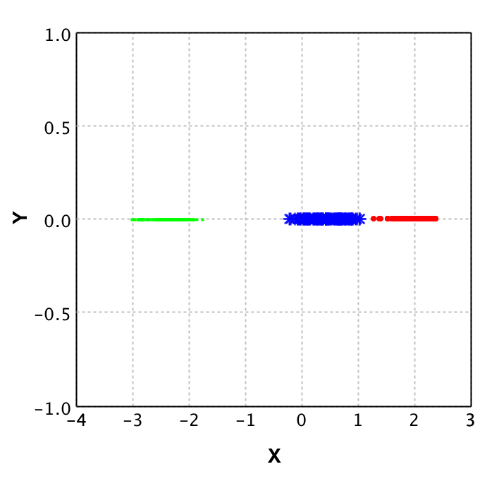

On the left plot the original data is shown, where each color represents a different class. It is clear that from the 2 dimensions (X and Y) you could reduce to 1 dimension and still classify properly. This is where PCA comes in place. With PCA a new value is calculated for each datapoint, based on its original dimensions. 

In the plot on the right you see the result of applying PCA to this data. Note that there is a y value, but this is purely to be able to plot the data and show it to you. This Y value is 0 for all values as only the X values are returned by the PCA algorithm. Also note that the values for X in the right plot do not correspond to the values in the left plot, this shows that PCA not 'just drops' a dimension.

##Validation techniques
In this section we will explain some of the techniques available for model validation, and some terms that are commonly used in the Machine Learning field within the scope of validation techniques.

###Cross validation
The technique of cross validation is one of the most common techniques in the field of machine learning. Its essence is to *ignore* part of your dataset while training your [model](#model), and then using the model to predict this *ignored data*. Comparing the predictions to the actual value then gives an indication of the performance of your model, and the quality of your training data.

The most important part of this cross validation is the splitting of data. You should always use the complete dataset when performing this technique. In other words you should not randomly select X datapoints for training and then randomly select X datapoints for testing, because then some datapoints can be in both sets while others might not be used at all.

####(2 fold) Cross validation
In 2-fold cross validation you perform a split of the data into test and training for each fold (so 2 times) and train a model using the training dataset, followed by verification with the testing set. Doing so allows you to compute the error in the predictions for the test data 2 times. These error values then should not differ significantly. If they do, either something is wrong with your data or with the features you selected for model prediction. Either way you should look into the data more and find out what is happening for your specific case, as training a model based on the data might result in an [overfitted](#overfitting) model for erroneous data.

###Regularization
The basic idea of regularization is preventing [overfitting](#overfitting) your [model](#model) by simplifying it. Suppose your data is a 3rd degree polynomial function, but your data has noise and this would cause the model to be of a higher degree. Then the model would perform poorly on new data, whereas it seems to be a good model at first. Regularization helps preventing this, by simplifying the model with a certain value *lambda*. However to find the right lambda for a model is hard when you have no idea as to when the model is overfitted or not. This is why [cross validation](#cross-validation) is often used to find the best lambda fitting your model.

### Precision
In the field of computer science we use the term precision to define the amount of items selected which are actually relevant. So when you compute the precision value for a search algorithm on documents, the precision of that algorithm is defined by how many documents from the result set are actually relevant.

This value is computed as follows:

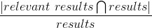

As this might be a bit hard to grasp I will give an example:

Say we have documents {aa, ab, bc, bd, ee} as the complete corpus, and we query for documents with `a` in the name. If our algorithm would then return the document set {aa, ab}, the precision would be 100% intuitively. Let's verify it by filling in the formula:

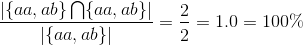

Indeed it is 100%. If we would run the query again but get more results than only {aa, ab}, say we additionally get {bc,de}  back as well, this influences the precision as follows:


Here the results contained the relevant results but also 2 irrelevant results. This caused the precision to decrease. However if you would calculate the [recall](#recall) for this example it would be 100%. This is how precision and recall differ from each other.

### Recall
Recall is used to define the amount of relevant items that are retrieved by an algorithm given a query and a data corpus. So given a set of documents, and a query that should return a subset of those documents, the recall value represents how many of the relevant documents are actually returned. This value is computed as follows:

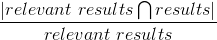

Given this formula, let's do an example to see how it works:

Say we have documents {aa,ab,bc,bd,ee} as complete corpus and we query for documents with `a` in the name. If our algorithm would be to return {aa,ab} the recall would be 100% intuitively. Let's verify it by filling in the formula:

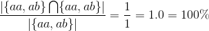

Indeed it is 100%. Next we shall show what happens if not all relevant results are returned:

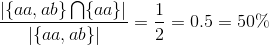

Here the results only contained half of the relevant results. This caused the recall to decrease. However if you would compute the [precision](#precision) for this situation, it would result in 100% precision, because all results are relevant.

### Prior
The prior value that belongs to a classifier given a datapoint represents the likelihood that this datapoint belongs to this classifier.  In practice this means that when you get a prediction for a datapoint, the prior value that is given with it, represents how 'convinced' the model is regarding the classification given to that datapoint. 


### Root Mean Squared Error (RMSE)
The Root Mean Squared Error (RMSE or RMSD where D stands for deviation) is the square root of the mean of the squared differences between the actual value and predicted value. As this is might be hard to grasp, I'll explain it using an example. Suppose we have the following values:

| Predicted temperature | Actual temperature | squared difference for Model | square difference for average |
| :--: | :--:| :--:| :--: | 
|10 | 12 | 4 | 7.1111 |
|20 | 17 | 9 | 5.4444 |
|15 | 15 | 0 | 0.1111 |

The mean of these squared differences for the model is 4.33333, and the root of this is 2.081666. So in average, the model predicts the values with an error of 2.08. The lower this RMSE value is, the better the model is in its predictions. This is why in the field, when selecting features, one computes the RMSE with and without a certain feature, in order to say something about how that feature affects the performance of the model. With this information one can then decide whether the additional computation time for this feature is worth it in comparison to the improvement rate on the model.

Additionally, because the RMSE is an absolute value, it can be normalised in order to compare models. This results in the Normalised Root Mean Square Error (NRMSE). For computing this however, you need to know the minimum and maximum value that the system can contain. Let's suppose we can have temperatures ranging from minimum of 5 to a maximum of 25 degrees, then computing the NRMSE is as follows:

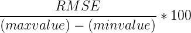

When we fill in the actual values we get the following result:

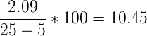

Now what is this 10.45 value? This is the error percentage the model has in average on its datapoints.

Finally we can use RMSE to compute a value that is known in the field as **R Squared**. This value represents how good the model performs in comparison to ignoring the model and just taking the average for each value. For that you need to calculate the RMSE for the average first. This is 4.22222 (taking the mean of the values from the last column in the table), and the root is then 2.054805. The first thing you should notice is that this value is lower than that of the model. This is not a good sign, because this means the model performs **worse** than just taking the mean. However to demonstrate how to compute **R Squared** we will continue the computations.

We now have the RMSE for both the model and the mean, and then computing how well the model performs in comparison to the mean is done as follows:

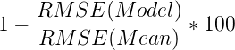

This results in the following computation:

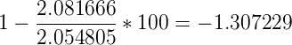

Now what does this -1.307229 represent? Basically it says that the model that predicted these values performs about 1.31 percent worse than returning the average each time a value is to be predicted. In other words, we could better use the average function as a predictor rather than the model in this specific case.

##Common pitfalls 
This section describes some common pitfalls in applying machine learning techniques. The idea of this section is to make you aware of these pitfalls and help you prevent actually walking into one yourself.

###Overfitting
When fitting a function on the data, there is a possibility the data contains noise (for example by measurement errors). If you fit every point from the data exactly, you incorporate this noise into the [model](#model). This causes the model to predict really well on your test data, but relatively poor on future data.

The left image here below shows how this overfitting would look like if you were to plot your data and the fitted functions, whereas the right image would represent a *good fit* of the regression line through the datapoints.

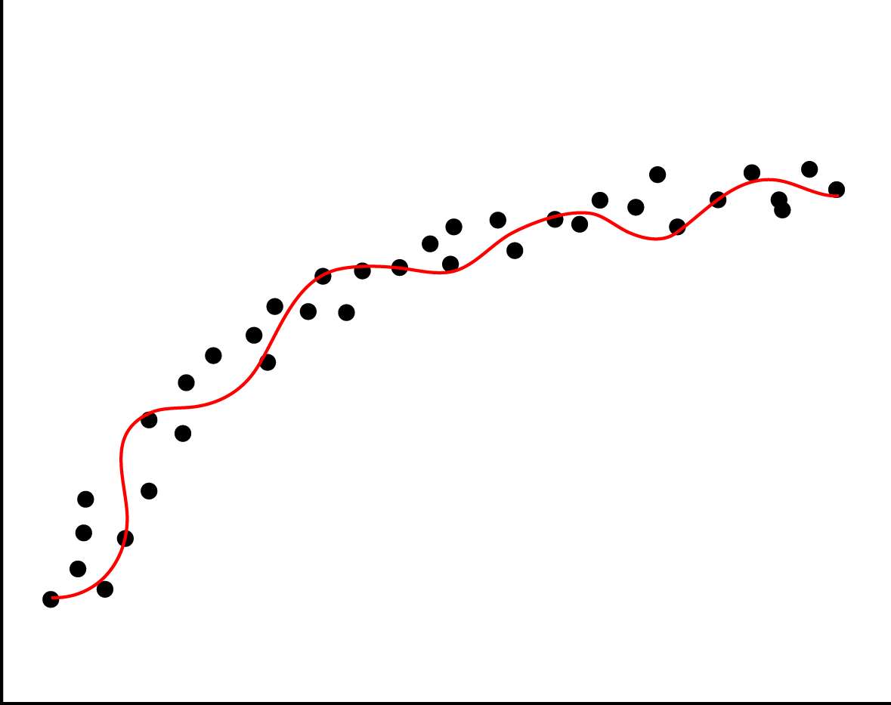 
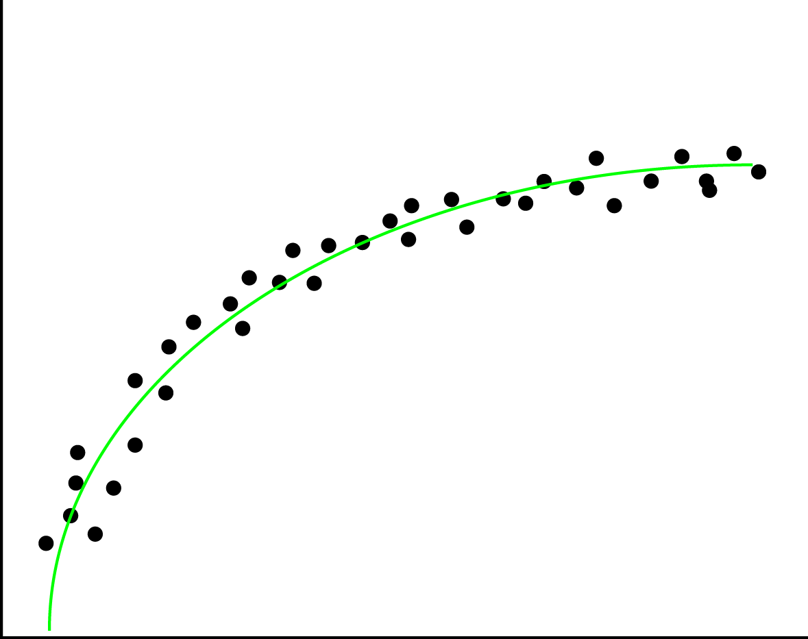

Overfitting can easily happen when applying [regression](#regression) but can just as easily be introduced in [Naive Bayes classifications](#classifying-email-as-spam-or-ham-naive-bayes). In regression it happens with rounding, bad measurements and noisy data. In naive bayes however, it could be the features that were picked. An example for this would be classifying spam or ham while keeping all stop words.

Overfitting can be detected by performing [validation techniques](#validation-techniques) and looking into your data's statistical features, and detecting and removing outliers.

### Underfitting
When you are turning your data into a model, but are leaving (a lot of) statistical data behind, this is called underfitting. This can happen due to various reasons, such as using a wrong regression type on the data. If you have a non-linear structure in the data, and you apply linear regression, this would result in an under-fitted model. The left image here below represents an under-fitted regression line whereas the right image shows a good fit regression line.

 


You can prevent underfitting by plotting the data to get insights in the underlying structure, and using [validation techniques](#validation-techniques) such as [cross validation](#2-fold-cross-validation). 

###Curse of dimensionality
The curse of dimensionality is a collection of problems that can occur when your data size is lower than the amount of features (dimensions) you are trying to use to create your machine learning [model](#model). An example of a dimensionality curse is matrix rank deficiency. When using [Ordinary Least Squares(OLS)](http://en.wikipedia.org/wiki/Ordinary_least_squares), the underlying algorithm solves a linear system in order to build up a model. However if you have more columns than you have rows, coming up with a single solution for this system is not possible. If this is the case, the best solution would be to get more datapoints or reduce the feature set. 

If you want to know more regarding this curse of dimensionality, there is [a study focussed on this issue](http://lectures.molgen.mpg.de/networkanalysis13/LDA_cancer_classif.pdf). In this study, researchers Haifeng Li, Keshu Zhang and Tao Jiang developed an algorithm that improves cancer classification with very few datapoints. They compared their algorithm with [support vector machines](http://en.wikipedia.org/wiki/Support_vector_machine) and [random forests](http://en.wikipedia.org/wiki/Random_forest).

##Dynamic machine learning
In almost all literature you can find about machine learning, a static model is generated and validated, and then used for predictions or recommendations. However in practice, this alone would not make a very good machine learning application. This is why in this section we will explain how to turn a static model into a dynamic model. Since the (most optimal) implementation depends on the algorithm you are using, we will explain the concept rather than giving a practical example. Because explaining it in text only will not be very clear we first present you the whole system in a diagram. We will then use this diagram to  explain machine learning and how to make the system dynamic.


The basic idea of machine learning can be described by the following steps:

1. Gather data
2. Split the data into a testing and training set
3. Train a model (with help of a machine learning algorithm)
4. Validate the model with a validation method which takes the model and testing data
5. do predictions based on the model

In this process there are a few steps missing when it comes to actual applications in the field. These steps are in my opinion the most important steps to make a system actually learn.

The idea behind what we call dynamic machine learning is as follows: You take your predictions, combine it with user feedback and feed it back into your system to improve your dataset and model. As we just said we need user feedback, so how is this gained? Let's take friend suggestions on [Facebook](https://www.facebook.com) for example. The user is presented 2 options: 'Add Friend' or 'Remove'. Based on the decision of the user, you have direct feedback regarding that prediction. 

So say you have this user feedback, then you can apply machine learning over your machine learning application to learn about the feedback that is given. This might sound a bit strange, but we will try to explain this more elaborately. However before we do this, we need to make a *disclaimer*: our description of the Facebook friend suggestion system is a 100% assumption and in no way confirmed by Facebook itself. Their systems are a secret to the outside world as far as we know.

Say the system predicts based on the following features:

1. amount of common friends
2. Same hometown
3. Same age

Then you can compute a [prior](#prior) for every person on Facebook regarding the chance that he/she is a good suggestion to be your friend. Say you store the results of all these predictions for a period of time, then analysing this data on its own with machine learning allows you to improve your system. To elaborate on this, say most of our 'removed' suggestions had a high rating on feature 2, but relatively low on 1, then we can add weights to the prediction system such that feature 1 is more important than feature 2. This will then improve the recommendation system for us. 

Additionally, the dataset grows over time, so we should keep on updating our model with the new data to make the predictions more accurate. How to do this however, depends on the size and mutation rate of your data. 

#Practical examples
In this section we present you a set of machine learning algorithms in a practical setting. The idea of these examples is to get you started with machine learning algorithms without an in depth explanation of the underlying algorithms. We focus purely on the functional aspect of these algorithms, how you can verify your implementation and finally try to make you aware of [common pitfalls](#common-pitfalls).

The following examples are available:

* [Labeling ISP's based on their down/upload speed (K-NN)](#labeling-isps-based-on-their-downupload-speed-k-nn-using-smile-in-scala)
* [Classifying email as spam or ham (Naive Bayes)](#classifying-email-as-spam-or-ham-naive-bayes)
* [Ranking emails based on their content (Recommendation system)](#ranking-emails-based-on-their-content-recommendation-system)
* [Predicting weight based on height (Linear Regression OLS)](#predicting-weight-based-on-height-using-ordinary-least-squares)
* [An attempt at rank prediction for top selling books using text regression](#an-attempt-at-rank-prediction-for-top-selling-books-using-text-regression)
* [Using unsupervised learning to merge features (PCA)](#using-unsupervised-learning-to-merge-features-pca)
* [Using Support Vector Machines (SVMS)](#using-support-vector-machines-svms)

For each of these examples we used the [Smile Machine Learning](https://github.com/haifengl/smile/releases) library. We used both the `smile-core` and `smile-plot` libraries. These libraries are available on [Maven](http://search.maven.org), Gradle, Ivy, SBT and Leiningen. Information on how to add them using one of these systems can be found [here for the core](https://www.versioneye.com/java/com.github.haifengl:smile-core/1.0.2), and [here for the plotting library](https://www.versioneye.com/java/com.github.haifengl:smile-plot/1.0.2).

So before you start working through an example, I assume you made a new project in your favourite IDE, and added the `smile-core` and `smile-plot` libraries to your project. Additional libraries when used, and how to get the example data is addressed per example.


##Labeling ISPs based on their down/upload speed (K-NN using Smile in Scala)

The goal of this section is to use the K-Nearest Neighbours (K-NN) Algorithm to classify download/upload speed pairs as [internet service provider (ISP)](http://en.wikipedia.org/wiki/Internet_service_provider) Alpha (represented by 0) or Beta (represented by 1). The idea behind K-NN is as follows: given a set of points that are classified, you can classify the new point by looking at its K neighbours (K being a positive integer). The idea is that you find the K-neighbours by looking at the euclidean distance between the new point and its surrounding points. For these neighbours you then look at the biggest representative class and assign that class to the new point.

To start this example you should download the [example data](./Example%20Data/KNN_Example_1.csv). Additionally you should set the path in the code snippet to where you stored this example data.

The first step is to load the CSV data file. As this is no rocket science, I provide the code for this without further explanation:

```scala

object KNNExample {
   def main(args: Array[String]): Unit = {
    val basePath = "/.../KNN_Example_1.csv"
    val testData = getDataFromCSV(new File(basePath))    
    }
    
  def getDataFromCSV(file: File): (Array[Array[Double]], Array[Int]) = {
    val source = scala.io.Source.fromFile(file)
    val data = source
    	.getLines()
    	.drop(1)
    	.map(x => getDataFromString(x))
    	.toArray
    	
    source.close()
    val dataPoints = data.map(x => x._1)
    val classifierArray = data.map(x => x._2)
    return (dataPoints, classifierArray)        
  }
  
  def getDataFromString(dataString: String): (Array[Double], Int) = {

    //Split the comma separated value string into an array of strings
    val dataArray: Array[String] = dataString.split(',')

    //Extract the values from the strings
    val xCoordinate: Double = dataArray(0).toDouble
    val yCoordinate: Double = dataArray(1).toDouble
    val classifier: Int = dataArray(2).toInt

    //And return the result in a format that can later 
    //easily be used to feed to Smile
    return (Array(xCoordinate, yCoordinate), classifier)
  }
}
```

First thing you might wonder now is *why is the data formatted this way*. Well, the separation between dataPoints and their label values is for easy splitting between testing and training data, and because the API expects the data this way for both executing the K-NN algorithm and plotting the data. Secondly the datapoints stored as an ```Array[Array[Double]]``` is done to support datapoints in more than just 2 dimensions.

Given the data the first thing to do next is to see what the data looks like. For this Smile provides a nice plotting library. In order to use this however, the application should be changed to a Swing application. Additionally the data should be fed to the plotting library to get a JPane with the actual plot. After changing your code it should look like this:

 ```scala
 
 object KNNExample extends SimpleSwingApplication {
  def top = new MainFrame {
    title = "KNN Example"
    val basePath = "/.../KNN_Example_1.csv"

    val testData = getDataFromCSV(new File(basePath))

    val plot = ScatterPlot.plot(testData._1,
    							 testData._2, 
    							 '@', 
    							 Array(Color.red, Color.blue)
    							)
    peer.setContentPane(plot)
    size = new Dimension(400, 400)

  }
  ...
  ```
 
The idea behind plotting the data is to verify whether K-NN is a fitting Machine Learning algorithm for this specific set of data. In this case the data looks as follows:


In this plot you can see that the blue and red points seem to be mixed in the area (3 < x < 5) and (5 < y < 7.5). Since the groups are mixed the K-NN algorithm is a good choice, as fitting a linear decision boundary would cause a lot of false classifications in the mixed area.

Given this choice to use the K-NN algorithm to be a good fit for this problem, let's continue with the actual Machine Learning part. For this the GUI is ditched since it does not really add any value. Recall from the section [*The global idea of Machine Learning*](#the-global-idea-of-machine-learning) that in machine learning there are 2 key parts: Prediction and Validation. First we will look at the validation, as using a model without any validation is never a good idea. The main reason to validate the model here is to prevent [overfitting](#overfitting). However, before we even can do validation, a *correct* K should be chosen. 

The drawback is that there is no golden rule for finding the correct K. However, finding a *good* K that allows for most datapoints to be classified correctly can be done by looking at the data. Additionally the K should be picked carefully to prevent undecidability by the algorithm. Say for example ```K=2```, and the problem has 2 labels, then when a point is between both labels, which one should the algorithm pick. There is a *rule of thumb* that K should be the square root of the number of features (on other words the number of dimensions). In our example this would be ```K=1```, but this is not really a good idea since this would lead to higher false-classifications around decision boundaries. Picking ```K=2``` would result in the error regarding our two labels, thus picking ```K=3``` seems like a good fit for now.

For this example we do [2-fold Cross Validation](http://en.wikipedia.org/wiki/Cross-validation_(statistics)). In general 2-fold cross validation is a rather weak method of model Validation, as it splits the dataset in half and only validates twice, which still allows for overfitting, but since the dataset is only 100 points, 10-fold (which is a stronger version) does not make sense, since then there would only be 10 datapoints used for testing, which would give a skewed error rate.

```scala

  def main(args: Array[String]): Unit = {
   val basePath = "/.../KNN_Example_1.csv"
    val testData = getDataFromCSV(new File(basePath))

    //Define the amount of rounds, in our case 2 and 
    //initialise the cross validation
    val cv = new CrossValidation(testData._2.length, validationRounds)

    val testDataWithIndices = (testData
    							._1
    							.zipWithIndex, 
    							testData
    							._2
    							.zipWithIndex)

    val trainingDPSets = cv.train
      .map(indexList => indexList
      .map(index => testDataWithIndices
      ._1.collectFirst { case (dp, `index`) => dp}.get))

    val trainingClassifierSets = cv.train
      .map(indexList => indexList
      .map(index => testDataWithIndices
      ._2.collectFirst { case (dp, `index`) => dp}.get))

    val testingDPSets = cv.test
      .map(indexList => indexList
      .map(index => testDataWithIndices
      ._1.collectFirst { case (dp, `index`) => dp}.get))

    val testingClassifierSets = cv.test
      .map(indexList => indexList
      .map(index => testDataWithIndices
      ._2.collectFirst { case (dp, `index`) => dp}.get))


    val validationRoundRecords = trainingDPSets
      .zipWithIndex.map(x => (	x._1,			
      							trainingClassifierSets(x._2),
      							testingDPSets(x._2),
      							testingClassifierSets(x._2)
      						   )
      					)

    validationRoundRecords
    	.foreach { record =>

      val knn = KNN.learn(record._1, record._2, 3)

      //And for each test data point make a prediction with the model
      val predictions = record
      	._3
      	.map(x => knn.predict(x))
		.zipWithIndex

      //Finally evaluate the predictions as correct or incorrect
      //and count the amount of wrongly classified data points.
      
      val error = predictions
      	.map(x => if (x._1 != record._4(x._2)) 1 else 0)
      	.sum

      println("False prediction rate: " + error / predictions.length * 100 + "%")
    }
  }
  ```
  
If you execute this code several times you might notice the false prediction rate to fluctuate quite a bit. This is due to the random samples taken for training and testing. When this random sample is taken a bit unfortunate, the error rate becomes much higher while when taking a good random sample, the error rate could be extremely low. 

Unfortunately I cannot provide you with a golden rule to when your model was trained with the best possible training set. One would say that the model with the least error rate is always the best, but when you recall the term [overfitting](#overfitting), picking this particular model might perform really bad on future data. This is why having a large enough and representative dataset is key to a good Machine Learning application. However, when aware of this issue, you could implement manners to keep updating your model based on new data and known correct classifications.

Let's recap what we've done so far. First you took care of getting the training and testing data. Next up you generated and validated several models and picked the model which gave the best results. Then we now have one final step to do, which is making predictions using this model:

```scala
val knn = KNN.learn(record._1, record._2, 3)
val unknownDataPoint = Array(5.3, 4.3)
val result = knn.predict(unknownDatapoint)
if (result == 0)
{
	println("Internet Service Provider Alpha")
}
else if (result == 1)
{
	println("Internet Service Provider Beta")
}
else
{
	println("Unexpected prediction")
}

```

The result of executing this code is labeling the ```unknownDataPoint``` (5.3, 4.3) as ISP Alpha. This is one of the easier points to classify as it is clearly in the Alpha field of the datapoints in the plot. As it is now clear how to do these predictions I won't present you with other points, but feel free to try out how different points get predicted.


##Classifying email as spam or ham (Naive Bayes)
In this example we will be using the [Naive Bayes algorithm](http://en.wikipedia.org/wiki/Naive_Bayes_classifier) to classify email as ham (good emails) or spam (bad emails) based on their content. The Naive Bayes algorithm calculates the probability for an object for each possible class, and then returns the class with the highest probability. For this probability calculation the algorithm uses features. The reason it's called *Naive* Bayes is because it does not incorporate any correlation between features. In other words, each feature counts the same. I'll explain a bit more using an example:

Say you are classifying fruits and vegetables based on the features *color*, *diameter* and *shape* and you have the following classes: *apple*, *tomato*, and *cranberry*.

Suppose you then want to classify an object with the following values for the features: (red,4 cm, round). This would obviously be a tomato for us, as it is way to small to be an apple, and too large for a cranberry. However, because the Naive Bayes algorithm evaluates each feature individually it will classify it as follows:

* Apple  66.6% probable (based on color, and shape)
* Tomato 100.0% probable (based on color, shape and size)
* cranberry 66.6% probable (based on color and shape)

Thus even though it seems really obvious that it can't be a cranberry or apple, Naive Bayes still gives it a 66.6% change of being either one. So even though it classifies the tomato correctly, it can give poor results in edge cases where the size is just outside the scope of the training set. However, for spam classification Naive Bayes works well, as spam or ham cannot be classified purely based on one feature (word).

As you should now have an idea on how the Naive Bayes algorithm works, we can continue with the actual example. For this example we will use the Naive Bayes implementation from [Smile](https://github.com/haifengl/smile) in Scala to classify emails as spam or ham based on their content.  

Before we can start however, you should download the [data](http://spamassassin.apache.org/publiccorpus/) for this example from the SpamAssasins public corpus. The data you need for the example is the [easy_ham](http://spamassassin.apache.org/publiccorpus/20030228_easy_ham.tar.bz2) and [spam](http://spamassassin.apache.org/publiccorpus/20030228_spam.tar.bz2) files, but the rest can also be used in case you feel like experimenting some more. You should unzip these files and adjust the file paths in the code snippets to match the location of the folders. Additionally you will need the [stop words file](./Example%20Data/stopwords.txt) for filtering purposes. 

As with every machine learning implementation, the first step is to load in the training data. However in this example we are taking it 1 step further into machine learning. In the [KNN examples](#labeling-isps-based-on-their-downupload-speed-knn-using-smile-in-scala) we had the download and upload speed as [features](#features). We did not refer to them as features, as they were the only properties available. For spam classification it is not completely trivial what to use as features. One can use the Sender, the subject, the message content, and even the time of sending as features for classifying as spam or ham.  

In this example we will use the content of the email as feature. By this we mean we will select the features (words in this case) from the bodies of the emails in the training set. In order to be able to do this, we need to build a [Term Document Matrix (TDM)](http://en.wikipedia.org/wiki/Document-term_matrix). 

We will start off with writing the functions for loading the example data. This will be done with a ```getMessage``` method which gets a filtered body from an email given a File as parameter.

```scala

def getMessage(file : File)  : String  =
  {
    //Note that the encoding of the example files is latin1,
    // thus this should be passed to the fromFile method.
    val source = scala.io.Source.fromFile(file)("latin1")
    val lines = source.getLines mkString "\n"
    source.close()
    //Find the first line break in the email, 
    //as this indicates the message body
    val firstLineBreak = lines.indexOf("\n\n")
    //Return the message body filtered by only text from a-z and to lower case
     
    return lines
    	.substring(firstLineBreak)
    	.replace("\n"," ")
    	.replaceAll("[^a-zA-Z ]","")
    	.toLowerCase()
  }
```

Now we need a method that gets all the filenames for the emails, from the example data folder structure that we provided you with.

```scala
  
  def getFilesFromDir(path: String):List[File] = {
    val d = new File(path)
    if (d.exists && d.isDirectory) {
      //Remove the mac os basic storage file, 
      //and alternatively for unix systems "cmds"
      
      d	.listFiles
      	.filter(x => x	.isFile &&
      				 !x	.toString
      				 	.contains(".DS_Store") 	&&
      				 !x	.toString
      				 	.contains("cmds"))
      				 	.toList
    } 
    else {
      List[File]()
    }
  }
```

And finally let's define a set of paths that make it easier to load the different datasets from the example data. Together with this we also directly define a sample size of 500, as this is the complete amount of training emails  available for the spam set. We take the same amount of ham emails as the training set should be balanced for these two classification groups.

```scala
  
  def main(args: Array[String]): Unit = {
    val basePath = "/Users/../Downloads/data"
    val spamPath = basePath + "/spam"
    val spam2Path = basePath + "/spam_2"
    val easyHamPath = basePath + "/easy_ham"
    val easyHam2Path = basePath + "/easy_ham_2"

  	val amountOfSamplesPerSet = 500
    val amountOfFeaturesToTake = 100   
    //First get a subset of the filenames for the spam 
    // sample set (500 is the complete set in this case)
    val listOfSpamFiles =   getFilesFromDir(spamPath)
    	.take(amountOfSamplesPerSet)
    //Then get the messages that are contained in these files
  	val spamMails = listOfSpamFiles.map(x => (x, getMessage(x)))
    
     //Get a subset of the filenames from the ham sample set
     // (note that in this case it is not necessary to randomly
     // sample as the emails are already randomly ordered)
     
  	val listOfHamFiles =   getFilesFromDir(easyHamPath)
  		.take(amountOfSamplesPerSet)
  	//Get the messages that are contained in the ham files
  	val hamMails  = listOfHamFiles
  		.map{x => (x,getMessage(x)) }
  }
  
```

Now that we have the training data for both the ham and the spam email, we can start building 2 [TDM's](http://en.wikipedia.org/wiki/Document-term_matrix). But before we show you the code for this, let's first explain shortly why we actually need this. The TDM will contain **ALL** words which are contained in the bodies of the training set, including frequency rate. However, since frequency might not be the best measure (as 1 email which contains 1.000.000 times the word 'cake' would mess up the complete table) we will also compute the **occurrence rate**. By this we mean, the amount of documents that contain that specific term. So let's start off with generating the two TDM's.

```scala

 val spamTDM  = spamMails
      .flatMap(email => email
        ._2.split(" ")
        .filter(word => word.nonEmpty)
        .map(word => (email._1.getName,word)))
        .groupBy(x => x._2)
        .map(x => (x._1, x._2.groupBy(x => x._1)))
        .map(x => (x._1, x._2.map( y => (y._1, y._2.length))))
        .toList

    //Sort the words by occurrence rate descending 
    //(amount of times the word occurs among all documents)
  val sortedSpamTDM = spamTDM
  	.sortBy(x =>  - (x._2.size.toDouble / spamMails.length))
  	
  val hamTDM  = hamMails
      .flatMap(email => email
      ._2.split(" ")
      .filter(word => word.nonEmpty)
      .map(word => (email._1.getName,word)))
      .groupBy(x => x._2)
      .map(x => (x._1, x._2.groupBy(x => x._1)))
      .map(x => (x._1, x._2.map( y => (y._1, y._2.length))))
      .toList

    //Sort the words by occurrence rate  descending 
    //(amount of times the word occurs among all documents)
    val sortedHamTDM = hamTDM
    	.sortBy(x =>  - (x._2.size.toDouble / spamMails.length))

```

Given the tables, I've generated images using a [wordcloud](http://www.wordle.net/) for some more insight. Let's take a look at the top 50 words for each table as represented in these images. Note that the red words are from the spam table and the green words are from the ham table. Additionally, the size of the words represents the occurrence rate. Thus the larger the word, the more documents contained that word at least once.

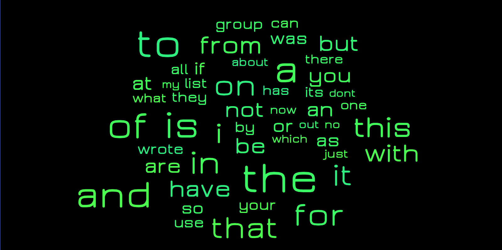


As you can see, mostly stop words come forward. These stop words are noise, which we should prevent as much as possible in our feature selection. Thus we should remove these from the tables before selecting the features. We've included a list of stop words in the example dataset. Let's first define the code to get these stop words.

```scala
  def getStopWords() : List[String] =
  {
    val source = scala.io.Source
    	.fromFile(new File("/Users/.../.../Example Data/stopwords.txt"))("latin1")
    val lines = source.mkString.split("\n")
    source.close()
    return  lines.toList
  }
 
```

Now we can expand the TDM generation code with removing the stop words from the intermediate results:

```scala

val stopWords = getStopWords

val spamTDM  = spamMails
      .flatMap(email => email
      ._2.split(" ")
      .filter(word => word.nonEmpty && !stopWords.contains(word))
      .map(word => (email._1.getName,word)))
      .groupBy(x => x._2)
      .map(x => (x._1, x._2.groupBy(x => x._1)))
      .map(x => (x._1, x._2.map( y => (y._1, y._2.length))))
      .toList


 val hamTDM  = hamMails
      .flatMap(email => email
      ._2.split(" ")
      .filter(word => word.nonEmpty && !stopWords.contains(word))
      .map(word => (email._1.getName,word)))
      .groupBy(x => x._2)
      .map(x => (x._1, x._2.groupBy(x => x._1)))
      .map(x => (x._1, x._2.map( y => (y._1, y._2.length))))
      .toList

```

If we once again look at the top 50 words for spam and ham, we see that most of the stop words are gone. We could fine-tune more, but for now let's go with this.


With this insight in what 'spammy' words and what typical 'ham-words' are, we can decide on building a feature-set which we can then use in the Naive Bayes algorithm for creating the classifier. Note: it is always better to include **more** features, however performance might become an issue when having all words as features. This is why in the field, developers tend to drop features that do not have a significant impact, purely for performance reasons. Alternatively machine learning is done running complete [Hadoop](http://hadoop.apache.org/) clusters, but explaining this would be outside the scope of this blog.

For now we will select the top 100 spammy words based on occurrence (thus not frequency) and do the same for ham words and combine this into 1 set of words which we can feed into the Bayes algorithm. Finally we also convert the training data to fit the input of the Bayes algorithm. Note that the final feature set thus is 200 - (#intersecting words *2). Feel free to experiment with higher and lower feature counts.

```scala

//Add the code for getting the TDM data and combining it into a feature bag.
val hamFeatures = hamTDM
	.records
	.take(amountOfFeaturesToTake)
	.map(x => x.term)
	
val spamFeatures = spamTDM
	.records
	.take(amountOfFeaturesToTake)
	.map(x => x.term)

//Now we have a set of ham and spam features,
// we group them and then remove the intersecting features, as these are noise.
var data = (hamFeatures ++ spamFeatures).toSet
hamFeatures
	.intersect(spamFeatures)
	.foreach(x => data = (data - x))

//Initialise a bag of words that takes the top x features 
//from both spam and ham and combines them
var bag = new Bag[String] (data.toArray)
//Initialise the classifier array with first a set of 0(spam)
//and then a set of 1(ham) values that represent the emails

var classifiers =  	Array.fill[Int](amountOfSamplesPerSet)(0) ++  
					Array.fill[Int](amountOfSamplesPerSet)(1)

//Get the trainingData in the right format for the spam mails
var spamData = spamMails
	.map(x => bag.feature(x._2.split(" ")))
	.toArray

//Get the trainingData in the right format for the ham mails
var hamData = hamMails
	.map(x => bag.feature(x._2.split(" ")))
	.toArray

//Combine the training data from both categories
var trainingData = spamData ++ hamData
```

Given this feature bag, and a set of training data, we can start training the algorithm. For this we can choose a few different models: `General`, `Multinomial` and `Bernoulli`. The `General` model needs to have a distribution defined, which we do not know on beforehand, so this is not a good option. The difference between the `Multinomial` and `Bernoulli` is the way in which they handle occurrence of words. The `Bernoulli` model only verifies whether a feature is there  (binary 1 or 0), thus leaves out the statistical data of occurrences, where as the `Multinomial` model incorporates the occurrences (represented by the value). This causes the `Bernoulli` model to perform bad on longer documents in comparison to the `Multinomial` model. Since we will be rating emails, and we want to use the occurrence, we focus on the multinomial but feel free to try out the `Bernoulli` model as well.

```scala
//Create the bayes model as a multinomial with 2 classification
// groups and the amount of features passed in the constructor.

  var bayes = new NaiveBayes(NaiveBayes.Model.MULTINOMIAL, 2, data.size)
  //Now train the bayes instance with the training data,
  // which is represented in a specific format due to the 
  //bag.feature method, and the known classifiers.

  bayes.learn(trainingData, classifiers)
```

Now that we have the trained model, we can once again do some validation. However, in the example data we already made a separation between easy and hard ham, and spam, thus we will not apply the cross validation, but rather validate the model using these test sets. We will start with validation of spam classification. For this we use the 1397 spam emails from the spam2 folder.

```scala
val listOfSpam2Files =   getFilesFromDir(spam2Path)
val spam2Mails = listOfSpam2Files
	.map{x => (x,getMessage(x)) }
	
val spam2FeatureVectors = spam2Mails
	.map(x => bag.feature(x._2.split(" ")))
	
val spam2ClassificationResults = spam2FeatureVectors
	.map(x => bayes.predict(x))

//Correct classifications are those who resulted in a spam classification (0)
val correctClassifications = spam2ClassificationResults
	.count( x=> x == 0)
	
println	(	correctClassifications + 
			" of " + 
			listOfSpam2Files.length + 
			"were correctly classified"
		)
		
println	((	(correctClassifications.toDouble / 
			 listOfSpam2Files.length) * 100)  +
			  "% was correctly classified"
		)

//In case the algorithm could not decide which category the email 
//belongs to, it gives a -1 (unknown) rather than a 0 (spam) or 1 (ham)

val unknownClassifications = spam2ClassificationResults
	.count( x=> x == -1)
	
println(	unknownClassifications + 
			" of " + 
			listOfSpam2Files.length +
			"were unknowingly classified"
		)
		
println(	(	(unknownClassifications.toDouble / 
				listOfSpam2Files.length) * 100)  + 
				% was unknowingly classified"
		)

```

If we run this code several times with different feature amounts, we get the following results:

| amountOfFeaturesToTake	| Spam (Correct)| Unknown| Ham | 
| ---------------------		|:-------------	| :----- |:----|
| 50      					| 1281 (91.70%)	| 16 (1.15%)	| 100 (7.15%) |
| 100     					| 1189 (85.11%)	| 18 (1.29%)	| 190 (13.6%)|
| 200     					| 1197 (85.68%)	| 16 (1.15%)	| 184 (13.17%)|
| 400     					| 1219 (87.26%)	| 13 (0.93%)	| 165 (11.81%)|

Note that the amount of emails classified as Spam are the ones that are correctly classified by the model. Interestingly enough, the algorithm works best for classifying spam with only 50 features. However, recall that there were still *stop words* in the top 50 classification terms which could explain this result. If you look at how the values change as the amount of features increase (starting at 100), you can see that with more features, the overall result increases. Note that there is a group of unknown emails. For these emails the [prior](#prior) was equal for both classes. Note that this also is the case if there are no feature words for ham nor spam in the email, because then the algorithm would classify it 50% ham and 50% spam.

We will now do the same classification process for the ham emails. This is done by  changing the path from the variable ```listOfSpam2Files``` to ```easyHam2Path``` and rerunning the code. This gives us the following results:

| amountOfFeaturesToTake	| Spam | Unknown| Ham  (Correct) | 
| ---------------------		|:-------------	| :----- |:----|
| 50      					| 120 (8.57%)	| 28 ( 2.0%)	| 1252 (89.43%)	|
| 100   					| 44 (3.14%)	| 11 (0.79%)	| 1345 (96.07%)	|
| 200 						| 36 (2.57%)	| 7 (0.5%)	| 1357 (96.93%)	|
| 400     					| 24 (1.71%)	| 7 (0.5%)	| 1369 (97.79%) |

Note that now the correctly classified emails are those who are classified as ham. Here we see that indeed, when you use only 50 features, the amount of ham that gets classified correctly is significantly lower in comparison to the correct classifications when using 100 features. You should be aware of this and always verify your model for all classes, so in this case for both spam and ham  test data.  

To recap the example, we've worked through how you can use Naive Bayes to classify email as ham or spam, and got results of up to 87.26% correct classification for spam and 97.79% for ham. This shows that Naive Bayes indeed performs pretty well for classifying email as ham or spam. 

With this we end the example of Naive Bayes. If you want to play around a bit more with Naive Bayes and Spam classification the corpus website also has a set of 'hard ham'  emails that you could try to classify correctly by tweaking the feature amounts and removing more stopwords.

##Ranking emails based on their content (Recommendation system)
This example will be completely about building your own recommendation system. We will be ranking emails based on the following features: 'sender', 'subject', 'common terms in subject' and 'common terms in email body'. Later on in the example we will explain each of these features. Note that these features are for you to be defined when you make your own recommendation system. When building your own recommendation system this is one of the hardest parts. Coming up with good features is not trivial, and when you finally selected features the data might not be directly usable for these features.

The main idea behind this example is to show you how to do this feature selection, and how to solve issues that occur when you start doing this with your own data.

We will use a subset of the email data which we used in the example [Classifying email as spam or ham](#classifying-email-as-spam-or-ham-naive-bayes). This subset can be downloaded [here](http://spamassassin.apache.org/publiccorpus/20030228_easy_ham.tar.bz2). Additionally you need the [stop words file](./Example%20Data/stopwords.txt). Note that the data is a set of received emails, thus we lack half of the data, namely the outgoing emails of this mailbox. However even without this information we can do some pretty nice ranking as we will see later on.

Before we can do anything regarding the ranking system, we first need to extract as much data as we can from our email set. Since the data is a bit tedious in its format we provide the code to do this. The inline comments explain why things are done the way they are. Note that the application is a swing application with a GUI from the start. We do this because we will need to plot data in order to gain insight later on. Also note that we directly made a split in testing and training data such that we can later on test our model.

```scala
import java.awt.{Rectangle}
import java.io.File
import java.text.SimpleDateFormat
import java.util.Date
import smile.plot.BarPlot

import scala.swing.{MainFrame, SimpleSwingApplication}
import scala.util.Try

object RecommendationSystem extends SimpleSwingApplication {

 case class EmailData(emailDate : Date, sender : String, subject : String, body : String)
 
  def top = new MainFrame {
    title = "Recommendation System Example"

    val basePath = "/Users/../data"
    val easyHamPath = basePath + "/easy_ham"

    val mails = getFilesFromDir(easyHamPath).map(x => getFullEmail(x))
    val timeSortedMails = mails
      .map	(x => EmailData	(	getDateFromEmail(x),
      							getSenderFromEmail(x), 
      							getSubjectFromEmail(x), 
      							getMessageBodyFromEmail(x)
      						)
      		)
      .sortBy(x => x.emailDate)

    val (trainingData, testingData) = timeSortedMails
      		.splitAt(timeSortedMails.length / 2)
      
      }

  def getFilesFromDir(path: String): List[File] = {
    val d = new File(path)
    if (d.exists && d.isDirectory) {
      //Remove the mac os basic storage file, 
      //and alternatively for unix systems "cmds"
      d.listFiles.filter(x => 	x.isFile &&
      					 		!x.toString.contains(".DS_Store") && 
      					 		!x.toString.contains("cmds")).toList
    } else {
      List[File]()
    }
  }

  def getFullEmail(file: File): String = {
    //Note that the encoding of the example files is latin1, 
    //thus this should be passed to the from file method.
    val source = scala.io.Source.fromFile(file)("latin1")
    val fullEmail = source.getLines mkString "\n"
    source.close()

    fullEmail
  }

  def getSubjectFromEmail(email: String): String = {

    //Find the index of the end of the subject line
    val subjectIndex = email.indexOf("Subject:")
    val endOfSubjectIndex = email	
    .substring(subjectIndex)						.indexOf('\n') + subjectIndex

    //Extract the subject: start of subject + 7 
    // (length of Subject:) until the end of the line.
    val subject = email
    .substring(subjectIndex + 8, endOfSubjectIndex)
    .trim
    .toLowerCase

    //Additionally, we check whether the email was a response and 
    //remove the 're: ' tag, to make grouping on topic easier:
    subject.replace("re: ", "")
  }

  def getMessageBodyFromEmail(email: String): String = {

    val firstLineBreak = email.indexOf("\n\n")
    //Return the message body filtered by only text 
    //from a-z and to lower case
    email.substring(firstLineBreak)
    .replace("\n", " ")
    .replaceAll("[^a-zA-Z ]", "")
    .toLowerCase
  }

  def getSenderFromEmail(email: String): String = {
    //Find the index of the From: line
    val fromLineIndex = email
    .indexOf("From:")
    
    val endOfLine = email
    .substring(fromLineIndex)
    .indexOf('\n') + fromLineIndex

    //Search for the <> tags in this line, as if they are there,
    // the email address is contained inside these tags
    
    val mailAddressStartIndex = email
    .substring(fromLineIndex, endOfLine)
    .indexOf('<') + fromLineIndex + 1
    
    val mailAddressEndIndex = email
    .substring(fromLineIndex, endOfLine)
    .indexOf('>') + fromLineIndex

    if (mailAddressStartIndex > mailAddressEndIndex) {

      //The email address was not embedded in <> tags,
      // extract the substring without extra spacing and to lower case
      var emailString = email
      .substring(fromLineIndex + 5, endOfLine)
      .trim
      .toLowerCase

      //Remove a possible name embedded in () at the end of the line,
      //for example in test@test.com (tester) the name would be removed here
      val additionalNameStartIndex = emailString.indexOf('(')
      if (additionalNameStartIndex == -1) {
        emailString
        .toLowerCase
      }
      else {
        emailString
        .substring(0, additionalNameStartIndex)
        .trim
        .toLowerCase
      }
    }
    else {
      //Extract the email address from the tags. 
      //If these <> tags are there, there is no () with a name in
      // the From: string in our data
      email
      .substring(mailAddressStartIndex, mailAddressEndIndex)
      .trim
      .toLowerCase
    }
  }

  def getDateFromEmail(email: String): Date = {
    //Find the index of the Date: line in the complete email
    val dateLineIndex = email
    .indexOf("Date:")
    
    val endOfDateLine = email
    .substring(dateLineIndex)
    .indexOf('\n') + dateLineIndex

    //All possible date patterns in the emails.
    val datePatterns = Array(	"EEE MMM dd HH:mm:ss yyyy",
     							"EEE, dd MMM yyyy HH:mm", 
    							"dd MMM yyyy HH:mm:ss", 
     							"EEE MMM dd yyyy HH:mm")

    datePatterns.foreach { x =>
      //Try to directly return a date from the formatting.
      //when it fails on a pattern it continues with the next one
      // until one works
      
      Try(return new SimpleDateFormat(x)
      				.parse(email
      						.substring(dateLineIndex + 5, endOfDateLine)
      						.trim.substring(0, x.length)))
    }
    //Finally, if all failed return null 
    //(this will not happen with our example data but without 
    //this return the code will not compile)
    null
  }
}

```

This pre-processing of the data is very common and can be a real pain when your data is not standardised such as with the dates and senders of these emails. However given this chunk of code we now have available the following properties of our example data: full email, receiving date, sender, subject, and body. This allows us to continue working on the actual features to use in the recommendation system. 

The first recommendation feature we will make is based on the sender of the email. Those who you receive more emails from should be ranked higher than ones you get less email from. This is a strong assumption, but instinctively you will probably agree, given the fact that spam is left out. Let's look at the distribution of senders over the complete email set.

```scala

//Add to the top body:

//First we group the emails by Sender, then we extract only the sender address 
//and amount of emails, and finally we sort them on amounts ascending
val mailsGroupedBySender = trainingData
.groupBy(x => x.sender)
.map(x => (x._1, x._2.length))
.toArray
.sortBy(x => x._2)

//In order to plot the data we split the values from the addresses as 
//this is how the plotting library accepts the data.
val senderDescriptions = mailsGroupedBySender
	.map(x => x._1)
	
val senderValues = mailsGroupedBySender
	.map(x => x._2.toDouble)

val barPlot = BarPlot.plot("", senderValues, senderDescriptions)
   
//Rotate the email addresses by -80 degrees such that we can read them
barPlot.getAxis(0).setRotation(-1.3962634)
barPlot.setAxisLabel(0, "")
barPlot.setAxisLabel(1, "Amount of emails received ")
peer.setContentPane(barPlot)

bounds = new Rectangle(800, 600)

```

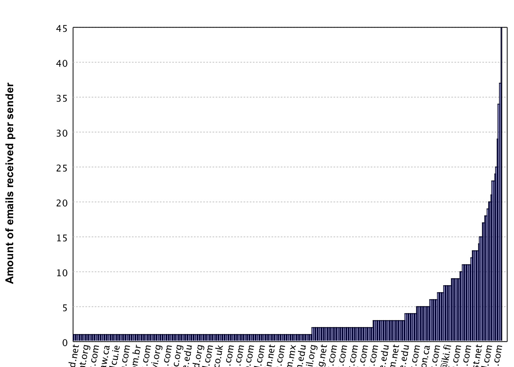 

Here you can see that the most frequent sender sent 45 emails, followed by 37 emails and then it goes down rapidly. Due to these 'huge' outliers, directly using this data would result in the highest 1 or 2 senders to be rated as very important whereas the rest would not be considered in the recommendation system. In order to prevent this behaviour we will re-scale the data  by taking ```log1p```.  The ```log1p``` function takes the log of the value but on beforehand adds 1 to the value. This addition of 1 is to prevent trouble when taking the log value for senders who sent only 1 email. After taking the log the data looks like this.

```scala

//Code changes:
val mailsGroupedBySender = trainingData
	.groupBy(x => x.sender)
	.map(x => (x._1, Math.log1p(x._2.length)))
	.toArray
	.sortBy(x => x._2)

barPlot.setAxisLabel(1, "Amount of emails received on log Scale ")

```


Effectively the data is still the same, however it is represented on a different scale.
Notice here that the numeric values now range between 0.69 and 3.83. This range is much smaller, causing the outliers to not skew away the rest of the data. This data manipulation trick is very common in the field of machine learning. Finding the right scale requires some insight. This is why using the plotting library of [Smile](https://github.com/haifengl/smile) to make several plots on different scales can help a lot when performing this rescaling.

The next feature we will work on is the frequency and timeframe in which subjects occur. If a subject occurs more it is likely to be of higher importance. Additionally we take into account the timespan of the thread. So the frequency of a subject will be normalised with the timespan of the emails of this subject. This makes highly active email threads come up on top. Again this is an assumption we make on which emails should be ranked higher.

Let's have a look at the subjects and their occurrence counts:

```scala
//Add to 'def top'  
val mailsGroupedByThread = trainingData
	.groupBy(x => x.subject)

//Create a list of tuples with (subject, list of emails)
val threadBarPlotData = mailsGroupedByThread
	.map(x => (x._1, x._2.length))
	.toArray
	.sortBy(x => x._2)
	
val threadDescriptions = threadBarPlotData
	.map(x => x._1)
val threadValues = threadBarPlotData
	.map(x => x._2.toDouble)

//Code changes in 'def top'
val barPlot = BarPlot.plot(threadValues, threadDescriptions)
barPlot.setAxisLabel(1, "Amount of emails per subject")

```


We see a similar distribution as with the senders, so let's apply the `log1p` once more.

```scala

//Code change:
val threadBarPlotData = mailsGroupedByThread
	.map(x => (x._1, Math.log1p(x._2.length)))
	.toArray
	.sortBy(x => x._2)
```
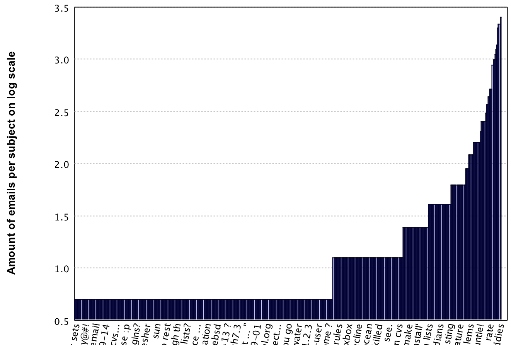

Here the value's now range between 0.69 and 3.41, which is a lot better than a range of 1 to 29 for the recommendation system. However we did not incorporate the time frame yet, thus we go back to the normal frequency and apply the transformation later on. To be able to do this, we first need to get the time between the first and last thread:

```scala
//Create a list of tuples with (subject, list of emails, 
//time difference between first and last email)
val mailGroupsWithMinMaxDates = mailsGroupedByThread
 .map(x => (x._1, x._2,
    		 (x._2
    			.maxBy(x => x.emailDate)
    			.emailDate.getTime - 
    		 x._2
    		 	.minBy(x => x.emailDate)
    		 	.emailDate.getTime
    						) / 1000
    		  )
      )

//turn into a list of tuples with (topic, list of emails, 
// time difference, and weight) filtered that only threads occur
val threadGroupedWithWeights = mailGroupsWithMinMaxDates
 .filter(x => x._3 != 0)
 .map(x => (x._1, x._2, x._3, 10 + 
    			Math.log10(x._2.length.toDouble / x._3)))
 .toArray
 .sortBy(x => x._4)
 
val threadGroupValues = threadGroupedWithWeights
 .map(x => x._4)
val threadGroupDescriptions = threadGroupedWithWeights
 .map(x => x._1)
    
//Change the bar plot code to plot this data:
val barPlot = BarPlot.plot(threadGroupValues, threadGroupDescriptions)
barPlot.setAxisLabel(1, "Weighted amount of emails per subject")    

```

Note how we determine the difference between the min and the max, and divide it by 1000. This is to scale the time value from milliseconds to seconds. Additionally we compute the weights by taking the frequency of a subject  and dividing it by the time difference. Since this value is very small, we want to rescale it up a little, which is done by taking the ```10log```. This however causes our values to become negative, which is why we add a basic value of 10 to make every value positive. The end result of this weighting is as follows:

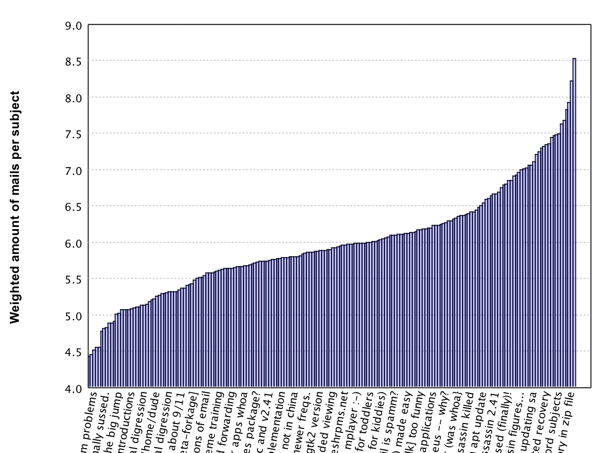

We see our values ranging roughly between (4.4 and 8.6) which shows that outliers do not largely influence the feature anymore. Additionally we will look at the top 10 vs bottom 10 weights to get some more insight in what happened.

**Top 10 weights:**

| Subject 	| Frequency	| Time frame (seconds) 	| Weight |
| :-- 		| :-- 		| :-- 			| :-- | 
|[ilug] what howtos for soho system | 2 | 60  | 8.52 |
|[zzzzteana] the new steve earle  | 2  | 120 | 8.22 | 
| [ilug] looking for a file / directory in zip file | 2 | 240 | 7.92 |
| ouch... [bebergflame]| 2 |300  | 7.82|
| [ilug] serial number in hosts file | 2 | 420 |  7.685 |
| [ilug] email list management howto | 3 | 720 |  7.62 | 
| should mplayer be build with win32 codecs?  | 2 | 660 |  7.482 |
| [spambayes] all cap or cap word subjects  | 2 | 670 |  7.48 |
| [zzzzteana] save the planet, kill the people  | 3 | 1020 |  7.47 |
| [ilug] got me a crappy laptop  | 2 | 720 | 7.44 |

**Bottom 10 weights:**

| Subject 	| Frequency	| Time frame (seconds) 	| Weight |
| :-- 		| :-- 		| :-- 			| :-- | 
|secure sofware key | 14  | 1822200 | 4.89 | 
|[satalk] help with postfix + spamassassin | 2  | 264480 | 4.88 | 
|<nettime> the war prayer | 2  | 301800 | 4.82 | 
|gecko adhesion finally sussed. | 5  | 767287 | 4.81 | 
|the mime information you requested (last changed 3154 feb 14) | 3  | 504420 | 4.776 | 
|use of base image / delta image for automated recovery from | 5  | 1405800 | 4.55 | 
|sprint delivers the next big thing?? | 5  | 1415280 | 4.55 | 
|[razor-users] collision of hashes? | 4  | 1230420 | 4.51 | 
|[ilug] modem problems | 2  | 709500 | 4.45 | 
|tech's major decline | 2  | 747660 | 4.43 | 

As you can see the highest weights are given to emails which almost instantly got a follow up email response, whereas the lowest weights are given to emails with very long timeframes. This allows for emails with a very low frequency to still be rated as very important based on the timeframe in which they were sent. With this we have 2 features: the amount of emails from a sender ```mailsGroupedBySender```, and the weight of emails that belong to an existing thread ```threadGroupedWithWeights```.

Let's continue with the next feature, as we want to base our ranking values on as many features as possible. This next feature will be based on the weight ranking that we just computed. The idea is that new emails with different subjects will arrive. However, chances are that they contain keywords that are similar to earlier received important subjects. This will allow us to rank emails as important before a thread (multiple messages with the same subject) was started. For that we specify the weight of the keywords to be the weight of the subject in which the term occurred. If this term occurred in multiple threads, we take the highest weight as the leading one.

There is one issue with this feature, which are stop words. Luckily we have a stop words file that allows us to remove (most) english stop words for now. However, when designing your own system you should take into account that multiple languages can occur, thus you should remove stop words for all languages that can occur in the system. Additionally you might need to be careful with removing stop words from different languages, as some words may have different meanings among the different languages. As for now we stick with removing English stop words. The code for this feature is as follows:

```scala

  def getStopWords: List[String] = {
    val source = scala.io.Source
    	.fromFile(new File("/Users/../stopwords.txt"))("latin1")
    val lines = source.mkString.split("\n")
    source.close()
    lines.toList
   }

//Add to top:
val stopWords = getStopWords

val threadTermWeights =  threadGroupedWithWeights
	.toArray
	.sortBy(x => x._4)
	.flatMap(x => x._1
			.replaceAll("[^a-zA-Z ]", "")
			.toLowerCase.split(" ")
			.filter(_.nonEmpty)
			.map(y => (y,x._4)))
			
val filteredThreadTermWeights = threadTermWeights
	.groupBy(x => x._1)
	.map(x => (x._1, x._2.maxBy(y => y._2)._2))
	.toArray.sortBy(x => x._1)
	.filter(x => !stopWords.contains(x._1))

```

Given this code we now have a list ```filteredThreadTermWeights``` of terms including weights that are based on existing threads. These weights can be used to compute the weight of the subject of a new email even if the email is not a response to an existing thread.

As fourth feature we want to incorporate weighting based on the terms that are occurring with a high frequency in all the emails. For this we build up a [TDM](http://en.wikipedia.org/wiki/Document-term_matrix), but this time the TDM is a bit different as in the former examples, as we only log the frequency of the terms in all documents. Furthermore we take the log10 of the occurrence counts. This allows us to scale down the term frequencies such that the results do not get affected by possible outlier values.

```scala

val tdm = trainingData
      .flatMap(x => x.body.split(" "))
      .filter(x => x.nonEmpty && !stopWords.contains(x))
      .groupBy(x => x)
      .map(x => (x._1, Math.log10(x._2.length + 1)))
      .filter(x => x._2 != 0)

```

This ```tdm``` list  allows us to compute an importance weight for the email body of new emails based on historical data. 

With these preparations for our 4 features, we can make our actual ranking calculation for the training data. For this we need to find the ```senderWeight``` (representing the weight of the sender) , ```termWeight``` (representing the weight of the terms in the subject), ```threadGroupWeight``` (representing the thread weight) and ```commonTermsWeight``` (representing the weight of the body of the email) for each email and multiply them to get the final ranking. Due to the fact that we multiply, and not add the values, we need to take care of values that are  ```< 1```. Say for example someone sent 1 email, then the ```senderWeight``` would be 0.69, which would be unfair in comparison to someone who didn't send any email before yet, because he/she would get a ```senderWeight``` of 1. This is why we take the ```Math.max(value,1)``` for each feature that can have values below 1. Let's take a look at the code:


```scala

    val trainingRanks = trainingData.map(mail => {

      //Determine the weight of the sender, if it is lower than 1, pick 1 instead
      //This is done to prevent the feature from having a negative impact
      val senderWeight = mailsGroupedBySender
        .collectFirst { case (mail.sender, x) =>  Math.max(x,1)}
        .getOrElse(1.0)

      //Determine the weight of the subject
      val termsInSubject = mail.subject
        .replaceAll("[^a-zA-Z ]", "")
        .toLowerCase.split(" ")
        .filter(x => 	x.nonEmpty &&
        !stopWords.contains(x)
        )

      val termWeight = if (termsInSubject.size > 0)
        Math.max(termsInSubject
          .map(x => {
          tdm.collectFirst { case (y, z) if y == x => z}
            .getOrElse(1.0)
        })
          .sum / termsInSubject.length,1)
      else 1.0

      //Determine if the email is from a thread,
      //and if it is the weight from this thread:
      val threadGroupWeight: Double = threadGroupedWithWeights
        .collectFirst { case (mail.subject, _, _, weight) => weight}
        .getOrElse(1.0)

      //Determine the commonly used terms in the email and the weight belonging to it:
      val termsInMailBody = mail.body
        .replaceAll("[^a-zA-Z ]", "")
        .toLowerCase.split(" ")
        .filter(x => 	x.nonEmpty &&
        !stopWords.contains(x)
        )

      val commonTermsWeight = if (termsInMailBody.size > 0)
        Math.max(termsInMailBody
          .map(x => {
          tdm.collectFirst { case (y, z) if y == x => z}
            .getOrElse(1.0)
        })
          .sum / termsInMailBody.length,1)
      else 1.0

      val rank = 	termWeight *
        threadGroupWeight *
        commonTermsWeight *
        senderWeight

      (mail, rank)
    })

    val sortedTrainingRanks = trainingRanks
      .sortBy(x => x._2)
    val median = sortedTrainingRanks(sortedTrainingRanks.length / 2)._2
    val mean = 	sortedTrainingRanks
      .map(x => x._2).sum /
    			sortedTrainingRanks.length
```
As you can see we computed the ranks for all training emails, and additionally sorted them and got the median and the mean. The reason we take this median and mean is to have a *decision boundary* for rating an email as priority or non-priority. In practice, this usually doesn't work out. The best way to actually get this decision boundary is to let the user mark a set of emails as priority vs non priority. You can then use those ranks to calculate the decision boundary, and additionally see if the ranking features are correct. If the user ends up marking emails as non-priority who have a higher ranking than emails that the user marked as priority, you might need to re-evaluate your features. 

The reason we come up with a decision boundary, rather than just sorting the users email on ranking is due to the time aspect. If you would sort emails purely based on the ranking, one would find this very annoying, because in general people like their email sorted on date. With this decision boundary however, we can mark emails as priority, and show them in a separate list if we were to incorporate our ranking into an email client.

Let's now look at how many emails from the testing set will be ranked as priority. For this we first have to add the following code:

```scala

  val testingRanks = trainingData.map(mail => {
      //mail contains (full content, date, sender, subject, body)

      //Determine the weight of the sender
      val senderWeight = mailsGroupedBySender
        .collectFirst { case (mail.sender, x) =>  Math.max(x,1)}
        .getOrElse(1.0)

      //Determine the weight of the subject
      val termsInSubject = mail.subject
        .replaceAll("[^a-zA-Z ]", "")
        .toLowerCase.split(" ")
        .filter(x => 	x.nonEmpty &&
        !stopWords.contains(x)
        )

      val termWeight = if (termsInSubject.size > 0)
        Math.max(termsInSubject
        .map(x => {
        tdm.collectFirst { case (y, z) if y == x => z}
          .getOrElse(1.0)
      })
        .sum / termsInSubject.length,1)
      else 1.0

      //Determine if the email is from a thread,
      //and if it is the weight from this thread:
      val threadGroupWeight: Double = threadGroupedWithWeights
        .collectFirst { case (mail.subject, _, _, weight) => weight}
        .getOrElse(1.0)

      //Determine the commonly used terms in the email and the weight belonging to it:
      val termsInMailBody = mail.body
        .replaceAll("[^a-zA-Z ]", "")
        .toLowerCase.split(" ")
        .filter(x => 	x.nonEmpty &&
        !stopWords.contains(x)
        )

      val commonTermsWeight = if (termsInMailBody.size > 0)
        Math.max(termsInMailBody
        .map(x => {
        tdm.collectFirst { case (y, z) if y == x => z}
          .getOrElse(1.0)
      })
        .sum / termsInMailBody.length,1)
      else 1.0

      val rank = 	termWeight *
        threadGroupWeight *
        commonTermsWeight *
        senderWeight

      (mail, rank)
    })


    val priorityEmails = testingRanks
    	.filter(x => x._2 >= mean)

    println(priorityEmails.length + " ranked as priority")

```

After actually running this test code, you will see that the amount of emails ranked as priority from the test set is actually 563. This is 45% of the test email set. This is quite a high value, so we could tweak a bit with the *decision boundary*. However, since we picked this for illustration purposes, and should not be picked to be the mean in practice, we won't look into that percentage any further. Instead we will look at the ranking of the top 10 of the priority emails. 

Note that I've removed part of the email address to prevent spam bots from crawling these mail addresses. We see in the table below that most of these top 10 priority emails are threads grouped together, which had very high activity. Take for example the highest ranked email. This email was a follow up to an email of 9 minutes earlier. This indicates that the email thread was important.  

| Date | Sender  | Subject  | Rank |
| :--- | :-- | :--  | :-- |
| Sat Sep 07 06:45:23 CEST 2002 | skip@... | [spambayes] can't write to cvs... | 81.11 |
| Sat Sep 07 21:11:36 CEST 2002 | tim.one@... | [spambayes] test sets? | 79.59 |
| Mon Sep 09 17:46:55 CEST 2002 | tim.one@... | [spambayes] deleting "duplicate" spam before training?  good idea | 79.54 |
| Mon Aug 26 14:43:00 CEST 2002 | tomwhore@... | how unlucky can you get? | 77.87 |
| Sat Sep 07 06:36:41 CEST 2002 | tim.one@... | [spambayes] can't write to cvs... | 77.77 |
| Sun Sep 08 21:13:40 CEST 2002 | tim.one@... | [spambayes] test sets? | 76.3 |
| Thu Sep 05 20:53:00 CEST 2002 | felicity@... | [razor-users] problem with razor 2.14 and spamassassin 2.41 | 75.44 |
| Fri Sep 06 07:09:11 CEST 2002 | tim.one@... | [spambayes] all but one testing | 72.77 |
| Sat Sep 07 06:40:45 CEST 2002 | tim.one@... | [spambayes] maybe change x-spam-disposition to something else... | 72.62 |
| Sat Sep 07 05:05:45 CEST 2002 | skip@... | [spambayes] maybe change x-spam-disposition to something else... | 72.27 |

Additionally we see that ```tim.one...``` occurs a lot in this table.  This indicates that either all his emails are important, or he sent so many emails, that the ranker automatically ranks them as priority.  As final step of this example we will look into this a bit more:

```scala

val timsEmails = testingRanks
	.filter(x => x._1.sender == "tim.one@...")
    .sortBy(x => -x._2)
timsEmails
	.foreach(x => println(	"| " + 
							x._1.emailDate +
						 	" | "  + 
						 	x._1.subject + 
						 	" | " + 
						 	df.format(x._2) + 
						 	" |")
						 )

```
If you run this code, a list of 45 emails is printed, and the bottom 10 ranks are as follows:


|Date |  Subject  | Rank | 
| :--- |  :--  | :-- |  
| Sun Sep 08 21:36:15 CEST 2002 | [spambayes] ditching wordinfo | 42.89 |
| Tue Sep 10 18:12:51 CEST 2002 | [spambayes] timtest broke? | 41.73 |
| Thu Sep 12 04:06:24 CEST 2002 | [spambayes] current histograms | 41.73 |
| Sun Sep 08 21:46:47 CEST 2002 | [spambayes] hammie.py vs. gbayes.py | 41.68 |
| Tue Sep 10 04:18:25 CEST 2002 | [spambayes] current histograms | 40.67 |
| Wed Sep 11 04:46:15 CEST 2002 | [spambayes] xtreme training | 39.83 |
| Tue Sep 10 19:26:05 CEST 2002 | [spambayes] timtest broke? | 39.73 |
| Thu Sep 12 01:37:13 CEST 2002 | [spambayes] stack.pop() ate my multipart message | 38.89 |
| Sat Sep 07 01:06:56 CEST 2002 | [spambayes] ditching wordinfo | 38.34 |
| Sat Sep 07 00:21:15 CEST 2002 | [spambayes] [ann] trained classifier available | 8.71 | 


If we recall that our decision boundary was the mean, which is 25.06, then we see only 1 email of Tim did not get ranked as priority. This indicates on one hand that our decision boundary is too low, but on the other hand that Tim might actually be sending a lot of important emails, since the rank can get below the decision boundary. Unfortunately we cannot provide you the exact answer since we are not the owner of this testing data. 

Validating a ranker like this is rather hard when you have no ground truth. One of the most common ways of validating and improving it is by actually presenting it to the user and letting him/her mark correct mistakes. These corrections can then be used to improve the system.

To recap, we saw how to get features from raw data, even when the data had 'huge' outliers, and  how to combine these features into a final ranking value. Furthermore we had an attempt at evaluating these features, but due to the lack of knowledge about the dataset we could not draw explicit conclusions. However, if you were to do the same on data you do know, then this should get you started on building your own ranking system. 

##Predicting weight based on height (using Ordinary Least Squares)
In this section we will introduce the [Ordinary Least Squares](http://en.wikipedia.org/wiki/Ordinary_least_squares) technique which is a form of linear regression. As this technique is quite powerful, it is important to have read [regression](#regression) and the [common pitfalls](#common-pitfalls) before starting with this example. We will cover some of these issues in this section, while others are shown in the sections [underfitting](#underfitting) and [overfitting](#overfitting).

The idea behind linear regression is that an 'optimal' regression line is fitted on your training datapoints. Note that this only works if your data is linear, and does not have huge outliers. If this is not the case you could try to manipulate your data until this is the case, for example by taking the ```sqrt``` or ```log``` over the data.


As always, the first thing to do when the project is set-up is to import a dataset. For this we provide you with the following [csv file](./Example%20Data/OLS_Regression_Example_3.csv) and code for reading this file:

```scala

  def getDataFromCSV(file: File): (Array[Array[Double]], Array[Double]) = {
    val source = scala.io.Source.fromFile(file)
    val data = source.getLines().drop(1).map(x => getDataFromString(x)).toArray
    source.close()
    var inputData = data.map(x => x._1)
    var resultData = data.map(x => x._2)

    return (inputData,resultData)
  }

  def getDataFromString(dataString: String): (Array[Double], Double) = {

    //Split the comma separated value string into an array of strings
    val dataArray: Array[String] = dataString.split(',')
    var person = 1.0

    if (dataArray(0) == "\"Male\"") {
      person = 0.0
    }

    //Extract the values from the strings
    //Since the data is in US metrics 
    //inch and pounds we will recalculate this to cm and kilo's
    val data : Array[Double] = Array(person,dataArray(1).toDouble * 2.54)
    val weight: Double = dataArray(2).toDouble * 0.45359237

    //And return the result in a format that can later easily be used to feed to Smile
    return (data, weight)
  }

```

Note that the data reader converts the values from the [Imperial system](http://en.wikipedia.org/wiki/Imperial_units) into the [Metric system](http://en.wikipedia.org/wiki/Metric_system). This has no big effects on the OLS implementation, but since the metric system is [more commonly used](http://www.realclearscience.com/blog/map%20metric%20jpg), we prefer to present the data in that system.

With these methods we get the data as an ```Array[Array[Double]]``` which represents the datapoints and an ```Array[Double]``` which represents the classifications as male or female. These formats are good for both plotting the data, and for feeding into the machine learning algorithm.

Let's first see what the data looks like. For this we plot the data using the following code.

```scala

object LinearRegressionExample extends SimpleSwingApplication {
  def top = new MainFrame {
    title = "Linear Regression Example"
    val basePath = "/Users/.../OLS_Regression_Example_3.csv"

    val testData = getDataFromCSV(new File(basePath))

    val plotData = (testData._1 zip testData._2).map(x => Array(x._1(1) ,x._2))
    val maleFemaleLabels = testData._1.map( x=> x(0).toInt)
    val plot =  ScatterPlot.plot(	plotData,
    								maleFemaleLabels,
    								'@',
    								Array(Color.blue, Color.green)
    							 )
    plot.setTitle("Weight and heights for male and females")
    plot.setAxisLabel(0,"Heights")
    plot.setAxisLabel(1,"Weights")

    peer.setContentPane(plot)
    size = new Dimension(400, 400)
  }

```

If you execute the code here above, a window will pop up which shows the **right** plot as shown in the image here below. Note that when you run the code, you can scroll to zoom in and out in the plot.


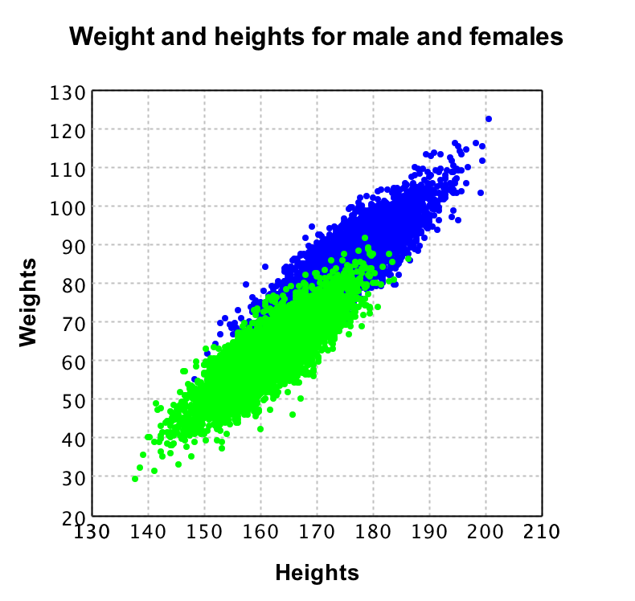

In this plot, given that green is female, and blue is male, you can see that there is a big overlap in their weights and heights. So if we were to ignore the difference between male and female it would still look like there was a linear function in the data (which can be seen in the **left** plot). However when ignoring this difference, the function would be not as accurate as it would be when we incorporate the information regarding males and females. 

Finding this distinction is trivial in this example, but you might encounter datasets where these groups are not so obvious. Making you aware of this this possibility might help you find groups in your data, which can improve the performance of your machine learning application.

Now that we have seen the data and see that indeed we can come up with a linear regression line to fit this data, it is time to train a [model](#model). Smile provides us with the [ordinary least squares](http://en.wikipedia.org/wiki/Ordinary_least_squares) algorithm which we can easily use as follows:

```scala
val olsModel = new OLS(testData._1,testData._2)
```

With this olsModel we can now predict someone's weight based on length and gender as follows: 

```scala
println("Prediction for Male of 1.7M: " +olsModel.predict(Array(0.0,170.0)))
println("Prediction for Female of 1.7M:" + olsModel.predict(Array(1.0,170.0)))
println("Model Error:" + olsModel.error())
```

and this will give the following results:

```
Prediction for Male of 1.7M: 79.14538559840447
Prediction for Female of 1.7M:70.35580395758966
Model Error:4.5423150758157185
```

If you recall from the classification algorithms, there was a [prior](#prior) value to be able to say something about the performance of your model. Since regression is a stronger statistical method, you have an actual error value now. This value represents how far off the fitted regression line is in average, such that you can say that for this model, the prediction for a male of 1.70m is 79.15kg  +/- the error of 4.54kg. Note that if you would remove the distinction between males and females, this error would increase to 5.5428. In other words, adding the distinction between male and female, increases the model accuracy by +/- 1 kg in its predictions.

Finally Smile also provides you with some statistical information regarding your model. The method ```RSquared``` gives you the [root-mean-square error (RMSE)](#root-mean-squared-error-rmse) from the model divided by the [RMSE](#root-mean-squared-error-rmse) from the mean. This value will always be between 0 and 1. If your model predicts every datapoint perfectly, RSquared will be 1, and if the model does not perform better than the mean function, the value will be 0. In the field this measure is often multiplied by 100 and then used as representation of how accurate the model is. Because this is a normalised value, it can be used to compare the performance of different models.

This concludes linear regression, if you want to know more about how to apply regression on  non-linear data, feel free to work through the next example [An attempt at rank prediction for top selling books using text regression](#an-attempt-at-rank-prediction-for-top-selling-books-using-text-regression).

##An attempt at rank prediction for top selling books using text regression

In the example of [predicting weights based on heights and gender](#predicting-weight-based-on-height-using-ordinary-least-squares) we introduced the notion of linear regression. However, sometimes one would want to apply regression on non numeric data such as text. 

In this example we will show how text regression can be done by an attempt at predicting the top 100 selling books from O'Reilly. Additionally with this example we will also show that for this particular case it does not work out to use text regression. The reason for this is that the data simply does not contain a signal for our test data. However this does not make this example useless because there might be an actual signal within the data you are using in practice, which then can be detected using text regression as explained here.

The data file we used in this example can be downloaded [here](./Example%20Data/TextRegression_Example_1.csv). Next to the Smile library, in this example we will also use the [Scala-csv library](https://www.versioneye.com/java/com.github.tototoshi:scala-csv_2.11/1.2.1) as the csv contains strings with comma's in them. Let's start off with getting the data we need:

```scala

object TextRegression  {

  def main(args: Array[String]): Unit = {

    //Get the example data
      val basePath = "/users/.../TextRegression_Example_4.csv"
      val testData = getDataFromCSV(new File(basePath))
  }

  def getDataFromCSV(file: File) : List[(String,Int,String)]= {
    val reader = CSVReader.open(file)
    val data = reader.all()

    val documents = data.drop(1).map(x => (x(1),x(3)toInt,x(4)))
    return documents
  }
}

```

We now have the title, rank and long description of the top 100 selling books from O'Reilly. However when we want to do regression of some form, we need numeric data. This is why we will build a [Document Term Matrix (DTM)](http://en.wikipedia.org/wiki/Document-term_matrix). Note that this DTM is similar to the Term Document Matrix (TDM) that we built in the spam classification example. Its difference is that we store document records containing which terms are in that document, in contrast to the TDM where we store records of words, containing a list of documents in which this term is available.

We implemented the DTM ourselves as follows:

```scala
import java.io.File
import scala.collection.mutable

class DTM {

  var records: List[DTMRecord] = List[DTMRecord]()
  var wordList: List[String] = List[String]()

  def addDocumentToRecords(documentName: String, rank: Int, documentContent: String) = {
    //Find a record for the document
    val record = records.find(x => x.document == documentName)
    if (record.nonEmpty) {
      throw new Exception("Document already exists in the records")
    }

    var wordRecords = mutable.HashMap[String, Int]()
    val individualWords = documentContent.toLowerCase.split(" ")
    individualWords.foreach { x =>
      val wordRecord = wordRecords.find(y => y._1 == x)
      if (wordRecord.nonEmpty) {
        wordRecords += x -> (wordRecord.get._2 + 1)
      }
      else {
        wordRecords += x -> 1
        wordList = x :: wordList
      }
    }
    records = new DTMRecord(documentName, rank, wordRecords) :: records
  }

  def getStopWords(): List[String] = {
    val source = scala.io.Source.fromFile(new File("/Users/.../stopwords.txt"))("latin1")
    val lines = source.mkString.split("\n")
    source.close()
    return lines.toList
  }

  def getNumericRepresentationForRecords(): (Array[Array[Double]], Array[Double]) = {
    //First filter out all stop words:
    val StopWords = getStopWords()
    wordList = wordList.filter(x => !StopWords.contains(x))
    
    var dtmNumeric = Array[Array[Double]]()
    var ranks = Array[Double]()

    records.foreach { x =>
      //Add the rank to the array of ranks
      ranks = ranks :+ x.rank.toDouble

      //And create an array representing all words and their occurrences 
      //for this document:
      var dtmNumericRecord: Array[Double] = Array()
      wordList.foreach { y =>

        val termRecord = x.occurrences.find(z => z._1 == y)
        if (termRecord.nonEmpty) {
          dtmNumericRecord = dtmNumericRecord :+ termRecord.get._2.toDouble
        }
        else {
          dtmNumericRecord = dtmNumericRecord :+ 0.0
        }
      }
      dtmNumeric = dtmNumeric :+ dtmNumericRecord

    }

    return (dtmNumeric, ranks)
  }
}

class DTMRecord(val document : String, 
				val rank : Int, 
				var occurrences :  mutable.HashMap[String,Int] 
				)

```

If you look at this implementation you'll notice that there is a method called  ```def getNumericRepresentationForRecords(): (Array[Array[Double]], Array[Double])```. This method returns a tuple with as first parameter a matrix in which each row represents a document, and each column represents one of the words from the complete vocabulary of the DTM's documents. Note that the doubles in the first table represent the number of occurrences of the words.

The second parameter is an array containing all the ranks belonging to the records from the first table. 

We can now extend our main code such that we get the numeric representation of all the documents as follows:

```scala

val documentTermMatrix  = new DTM()
testData.foreach(x => documentTermMatrix.addDocumentToRecords(x._1,x._2,x._3))

```

With this conversion from text to numeric value's we can open our regression toolbox. We used [Ordinary Least Squares(OLS)](http://en.wikipedia.org/wiki/Ordinary_least_squares) in the example [predicting weight based on height](#predicting-weight-based-on-height-using-ordinary-least-squares), however this time we will use [Least Absolute Shrinkage and Selection Operator (Lasso)](http://en.wikipedia.org/wiki/Least_squares#Lasso_method) regression. This is because we can give this regression method a certain lambda, which represents a penalty value. This penalty value allows the LASSO algorithm to select relevant features (words) while discarding some of the other features (words). 

This feature selection that Lasso performs is very useful in our case due too the large set of words that is used in the documents descriptions. Lasso will try to come up with an ideal subset of those words as features, whereas when applying the OLS, all words would be used, and the runtime would be extremely high. Additionally, the OLS implementation of Smile detects rank deficiency. This is one of the [curses of dimensionality](#curse-of-dimensionality)

We need to find an optimal lambda however, thus we should try for several lambda's using cross validation. We will do this as follows:

```scala

    for (i <- 0 until cv.k) {
      //Split off the training datapoints and classifiers from the dataset
      val dpForTraining = numericDTM
      	._1
      	.zipWithIndex
      	.filter(x => cv
      				.test(i)
      				.toList
      				.contains(x._2)
      			)
      	.map(y => y._1)
      	
      val classifiersForTraining = numericDTM
      	._2
      	.zipWithIndex
      	.filter(x => cv
      				.test(i)
      				.toList
      				.contains(x._2)
      			)
      	.map(y => y._1)

      //And the corresponding subset of data points and their classifiers for testing
      val dpForTesting = numericDTM
      	._1
      	.zipWithIndex
      	.filter(x => !cv
      				.test(i)
      				.contains(x._2)
      			)
      	.map(y => y._1)
      	
      val classifiersForTesting = numericDTM
      	._2
      	.zipWithIndex
      	.filter(x => !cv
      				.test(i)
      				.contains(x._2)
      			)
      	.map(y => y._1)

      //These are the lambda values we will verify against
      val lambdas: Array[Double] = Array(0.1, 0.25, 0.5, 1.0, 2.0, 5.0)

      lambdas.foreach { x =>
        //Define a new model based on the training data and one of the lambda's
        val model = new LASSO(dpForTraining, classifiersForTraining, x)

        //Compute the RMSE for this model with this lambda
        val results = dpForTesting.map(y => model.predict(y)) zip classifiersForTesting
        val RMSE = Math
        	.sqrt(results
        			.map(x => Math.pow(x._1 - x._2, 2)).sum /
        						 results.length
        				)
        println("Lambda: " + x + " RMSE: " + RMSE)

      }
    }
    
```

Running this code multiple times gives an [RMSE](#root-mean-squared-error) varying between 36 and 51. This means that the rank prediction we would do would be off by at least 36 ranks. Given the fact that we are trying to predict the top 100 ranks, it shows that the algorithm performs very poorly. Differences in lambda are in this case not noticeable. However when using this in practice you should be careful when picking the lambda value: The higher the lambda you pick, the lower the amount of features for the algorithm becomes. This is why cross validation is important to see how the algorithm performs on different lambda's.

To conclude this example, we rephrase a quote from [John Tukey](http://en.wikipedia.org/wiki/John_Tukey): 
>The data may not contain the answer. The combination of some data and an aching desire for an answer does not ensure that a reasonable answer can be extracted from a given body of data.

##Using unsupervised learning to merge features (PCA)

The basic idea of [PCA](#principal-components-analysis-pca) is to reduce the amount of dimensions of a problem. This can be useful for getting rid of the [curse of dimensionality](#curse-of-dimensionality) or to merge data such that you can see trends within the data without noise of correlated data. 

In this example we are going to use [PCA](#principal-components-analysis-pca) to merge stock prices from 24 stocks into 1 over a time period of 2002 - 2012. This single value (over time) then represents a stock market index based on data of these 24 stocks. Merging these 24 stock prices into 1 significantly reduces the amount of data to process, and decreases the dimension of our data, which is a big advantage if we later apply other machine learning algorithms such as regression for prediction. In order to see the performance of our feature reduction of 24 to 1, we will compare our result to the Dow Jones Index (DJI) over that same time period. 

With the project set-up the next step is to load the data. For this we provide you with 2 files: [Data file 1](./Example%20Data/PCA_Example_1.csv) and [Data file 2](./Example%20Data/PCA_Example_2.csv).

```scala
object PCA extends SimpleSwingApplication{


  def top = new MainFrame {
    title = "PCA Example"
    //Get the example data
    val basePath = "/users/.../Example Data/"
    val exampleDataPath = basePath + "PCA_Example_1.csv"
    val trainData = getStockDataFromCSV(new File(exampleDataPath))
    
    }
  def getStockDataFromCSV(file: File): (Array[Date],Array[Array[Double]]) = {
    val source = scala.io.Source.fromFile(file)
    //Get all the records (minus the header)
    val data = source
    	.getLines()
    	.drop(1)
    	.map(x => getStockDataFromString(x))
    	.toArray
    	
    source.close()
    //group all records by date, and sort the groups on date ascending
    val groupedByDate = data.groupBy(x => x._1).toArray.sortBy(x => x._1)
    //extract the values from the 3-tuple and turn them into
    // an array of tuples: Array[(Date, Array[Double)]
    val dateArrayTuples = groupedByDate
    	.map(x => (x._1, x
    					._2
    					.sortBy(x => x._2)
    					.map(y => y._3)
    				)
    		)

    //turn the tuples into two separate arrays for easier use later on
    val dateArray = dateArrayTuples.map(x => x._1).toArray
    val doubleArray = dateArrayTuples.map(x => x._2).toArray


    (dateArray,doubleArray)
  }

  def getStockDataFromString(dataString: String): (Date,String,Double) = {

    //Split the comma separated value string into an array of strings
    val dataArray: Array[String] = dataString.split(',')

    val format = new SimpleDateFormat("yyyy-MM-dd")
    //Extract the values from the strings

    val date = format.parse(dataArray(0))
    val stock: String = dataArray(1)
    val close: Double = dataArray(2).toDouble

    //And return the result in a format that can later 
    //easily be used to feed to Smile
    
    (date,stock,close)
  }
}
```

With this training data, and the fact that we already know that we want to merge the 24 features into 1 single feature, we can do the PCA and retrieve the values for the datapoints as follows.

```scala

//Add to `def top`
val pca = new PCA(trainData._2)
pca.setProjection(1)
val points = pca.project(trainData._2)
val plotData = points
	.zipWithIndex
	.map(x => Array(x._2.toDouble, -x._1(0) ))
	
val canvas: PlotCanvas = LinePlot.plot("Merged Features Index",
										 plotData, 
										 Line.Style.DASH, 
										 Color.RED);

peer.setContentPane(canvas)
size = new Dimension(400, 400)

```

This code not only does the PCA but also plots the results, with the feature value on the y axis and the individual days on the x axis.

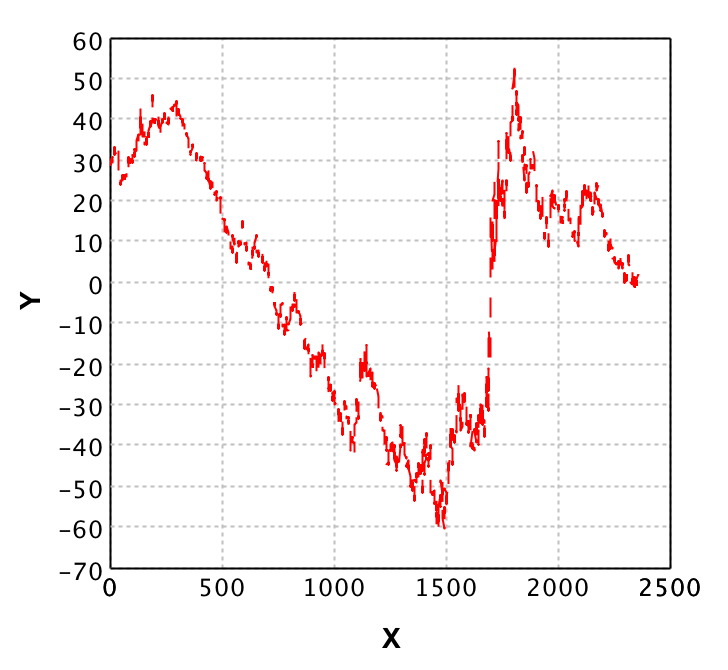

In order to be able to see how our PCA combination words, we should now add the Dow Jones index to the plot by adjusting the code as follows:


First we add this to the ```def top``` method
```scala
 
 //Verification against DJI
    val verificationDataPath = basePath + "PCA_Example_2.csv"
    val verificationData = getDJIFromFile(new File(verificationDataPath))
    val DJIIndex = getDJIFromFile(new File(verificationDataPath))
    canvas.line("Dow Jones Index", DJIIndex._2, Line.Style.DOT_DASH, Color.BLUE)

```

And then we need to introduce the following two methods:

```scala

  def getDJIRecordFromString(dataString: String): (Date,Double) = {

    //Split the comma separated value string into an array of strings
    val dataArray: Array[String] = dataString.split(',')

    val format = new SimpleDateFormat("yyyy-MM-dd")
    //Extract the values from the strings

    val date = format.parse(dataArray(0))
    val close: Double = dataArray(4).toDouble

    //And return the result in a format that can later 
    //easily be used to feed to Smile
    (date,close)
  }

  def getDJIFromFile(file: File): (Array[Date],Array[Double]) = {
    val source = scala.io.Source.fromFile(file)
    //Get all the records (minus the header)
    val data = source
    	.getLines()
    	.drop(1)
    	.map(x => getDJIRecordFromString(x)).toArray
    source.close()

    //turn the tuples into two separate arrays for easier use later on
    val sortedData = data.sortBy(x => x._1)
    val dates = sortedData.map(x => x._1)
    val doubles = sortedData.map(x =>   x._2 )

    (dates, doubles)
  }

```
This code loads the DJI data, and adds it in the plot which already contained our own index of the stock market. However, when we execute this code, the result plot is rather useless.

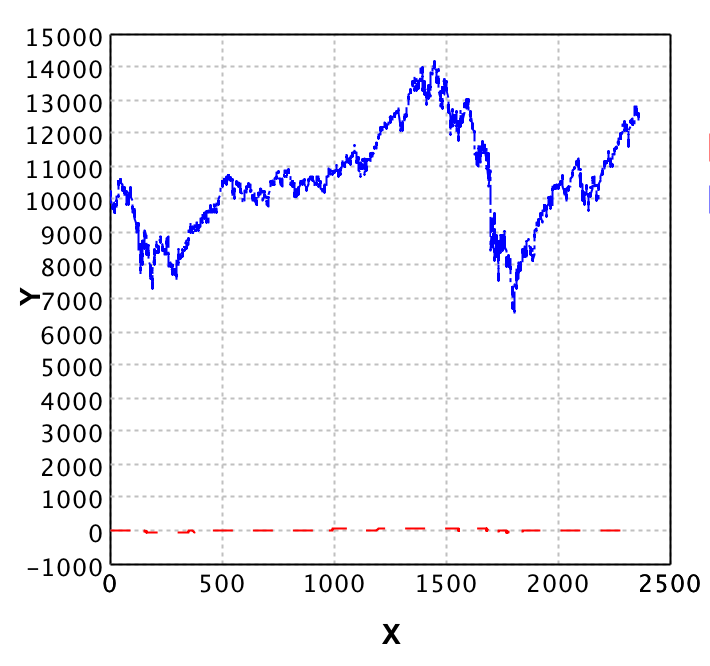

As you can see, the ranges of the DJI and our computed feature are far off. This is why we will now normalise the data. The idea is that we scale the data based on its range, such that both datasets are on the same scale.

Replace the ```getDJIFromFile``` method with the following:

```scala

def getDJIFromFile(file: File): (Array[Date],Array[Double]) = {
    val source = scala.io.Source.fromFile(file)
    //Get all the records (minus the header)
    val data = source
    	.getLines()
    	.drop(1)
    	.map(x => getDJIRecordFromString(x))
    	.toArray
    	
    source.close()

    //turn the tuples into two separate arrays for easier use later on
    val sortedData = data.sortBy(x => x._1)
    val dates = sortedData.map(x => x._1)
    val maxDouble = sortedData.maxBy(x => x._2)._2
    val minDouble = sortedData.minBy(x => x._2)._2
    val rangeValue = maxDouble - minDouble
    val doubles = sortedData.map(x =>   x._2 / rangeValue )

    (dates, doubles)
  }
  
```
and replace the `plotData` definition in the method```def top``` with

```scala
val maxDataValue = points.maxBy(x => x(0))
val minDataValue = points.minBy(x => x(0))
val rangeValue = maxDataValue(0) - minDataValue(0)
val plotData = points
	.zipWithIndex
	.map(x => Array(x._2.toDouble, -x._1(0) / rangeValue))
```

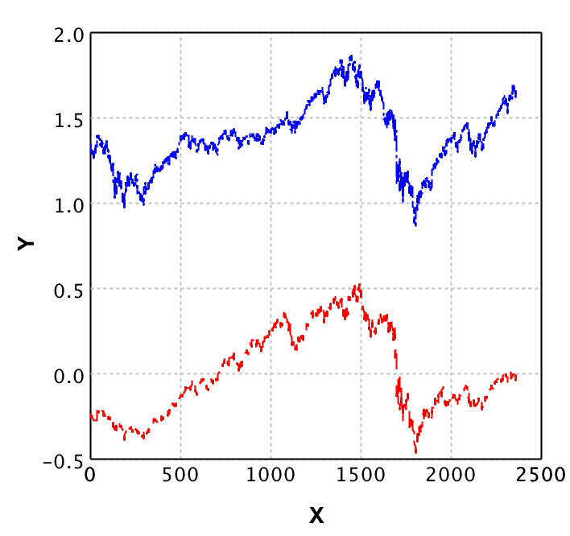

We see now that even though the data of the DJI ranges between 0.8 and 1.8 whereas our new feature ranges between -0.5 and 0.5, the trend lines correspond quite well. With this example, and the explanation of [PCA](#principal-components-analysis-pca) in the general section you should now be able to use PCA and apply it to your own data.

##Using Support Vector Machines (SVM's)

Before we actually go into using Support Vector Machines (SVM's)  I'll first mildly introduce what an SVM is. The basic SVM is a binary classifier that divides a dataset into 2 parts by picking a hyperplane that represents the largest separation between the datapoints. A SVM takes a so called 'correction rate' value. If there is no perfect split, the correction rate allows for picking a hyperplane that still splits as well as possible within that error rate. Thus the correction rate allows the hyperplane to be fit even when there are some points in the way. This means that we cannot come up with a 'standard' correction rate for every case. However when there is no overlap in the data, lower values should perform better than higher values. 

I just explained the basic SVM, which is a binary classifier, but this same idea can be used with more classes as well. However, for now we will stick with 2 classes, as there is enough to address already with just 2 classes.

In this example we will work through several small cases where a Support Vector Machine (SVM) will outperform other classifying algorithms such as [KNN](#labeling-isps-based-on-their-downupload-speed-knn-using-smile-in-scala). This approach is different from the former examples, but will help you understand how and when to use SVM's more easily. 

For each sub example we will provide code, a plot, a few test runs with different parameters on the SVM and an explanation on the results. This should give you an idea on the parameters to feed into the SVM algorithm. 


In the first example we will use the ```GaussianKernel```, but there are many other kernels available in [Smile](https://github.com/haifengl/smile). The other kernels can be found [here](http://haifengl.github.io/smile/doc/smile/math/kernel/MercerKernel.html). Next to the ```GaussianKernel``` we will address the ```PolynomialKernel``` as this one differs a lot from the Gaussian one.

We will use the following base for each example, with only the  ```filePaths``` and ```svm``` construction changing per example.

```scala

object SupportVectorMachine extends SimpleSwingApplication {


  def top = new MainFrame {
    title = "SVM Examples"
    //File path (this changes per example)
    val trainingPath =  "/users/.../Example Data/SVM_Example_1.csv"
	val testingPath =  "/users/.../Example Data/SVM_Example_1.csv"
    //Loading of the test data and plot generation stays the same
    val trainingData = getDataFromCSV(new File(path))
    val testingData = getDataFromCSV(new File(path))
    
    val plot = ScatterPlot.plot(	trainingData._1, 
    								trainingData._2, 
    								'@', 
    								Array(Color.blue, Color.green)
    							)
    peer.setContentPane(plot)

    //Here we do our SVM fine tuning with possibly different kernels
    val svm = new SVM[Array[Double]](new GaussianKernel(0.01), 1.0,2)
    svm.learn(trainingData._1, trainingData._2)
    svm.finish()

    //Calculate how well the SVM predicts on the training set
    val predictions = testingData
    	._1
    	.map(x => svm.predict(x))
    	.zip(testingData._2)
    	
    val falsePredictions = predictions
    	.map(x => if (x._1 == x._2) 0 else 1 )

    println(falsePredictions.sum.toDouble / predictions.length  
    				* 100 + " % false predicted")

    size = new Dimension(400, 400)
  }


  def getDataFromCSV(file: File): (Array[Array[Double]], Array[Int]) = {
    val source = scala.io.Source.fromFile(file)
    val data = source
    	.getLines()
    	.drop(1)
    	.map(x => getDataFromString(x))
    	.toArray
    	
    source.close()
    val dataPoints = data.map(x => x._1)
    val classifierArray = data.map(x => x._2)
    return (dataPoints, classifierArray)
  }

  def getDataFromString(dataString: String): (Array[Double], Int) = {
    //Split the comma separated value string into an array of strings
    val dataArray: Array[String] = dataString.split(',')

    //Extract the values from the strings
    val coordinates  = Array( dataArray(0).toDouble, dataArray(1).toDouble)
    val classifier: Int = dataArray(2).toInt

    //And return the result in a format that can later 
    //easily be used to feed to Smile
    return (coordinates, classifier)
  }
  
```

###Example 1 (Gaussian Kernel)
In this example we present the most commonly used kernel for SVMs, namely the Gaussian Kernel. The idea behind this example is to help finding good input parameters on this kernel. The data we used for this example can be downloaded [here](./Example%20Data/SVM_Example_1.csv).


It is clear from this plot that a linear regression line would not work. Instead we will use a SVM to make predictions. In the first code we gave, the ```GaussianKernel``` with a sigma of 0.01, a margin penalty of 1.0 and the amount of classes of 2 is passed to SVM. Now what does this all mean?

Let's start with the ```GaussianKernel```. This kernel represents the way in which the SVM will calculate the similarity over pairs of datapoints in the system. For the ```GaussianKernel``` the variance in the euclidian distance is used. The reason for picking the GaussianKernel specifically is because the data does not contain a clear structure such as a linear, polynomial or hyperbolic function. Instead the data is clustered in 3 groups. 

The parameter we pass in the constructor of the ```GaussianKernel``` is the sigma. This sigma value represents a smoothness value of the kernel. We will show how changing this parameter affects the predictions. As margin penalty we pass 1. This parameter defines the margin of the vectors in the system, thus making this value lower results in more bounded vectors. We will show with a set of runs and their results what kind of effect this has in practice. Note that the `s:` stands for sigma, and the `c:` stands for the correction penalty. The percentages represent the error rate in the prediction, which is simply the percentage of false predictions on the same dataset after training.

| c, s-> | 0.001 |  0.01 |  0.1 |  0.2 | 0.5 | 1.0 |  2.0 |  3.0 |  10.0 |
| :-- | :--: | :--: | :--: | :--: | :--: | :--: | :--: | :--: | :--: |
| **0.001** | 48.4% | 48.4% | 48.4% | 48.4% | 48.4% | 48.4% | 48.4% | 48.4% | 48.4% | 
|**0.01** | 48.4% | 48.4% | 40% | 43.8% | 48.4% | 48.4% | 48.4% | 48.4% | 48.4% |
| **0.1** | 48.4% | 48.4% | 12.4% | 14.2% | 17.4% | 48.4% | 48.4% | 48.4% | 48.4% | 
| **0.2** | 48.4% | 45.6% | 9.1% | 10.1% | 12.3% | 48.4% | 48.4% | 48.4% | 48.4% |
| **0.5** | 47.5% | 3.4% | 6.3% | 7.2% | 7% | 8.9% | 48.4% | 48.4% | 48.4% | 
| **1.0** | 0% | 1.6% | 5.1% | 5.7% | 5.6% | 5.6% | 48.4% | 48.4% | 48.4% |
| **2.0** | 0% | 1% | 5.2% | 5% | 5.4% | 5.7% | 13.1% | 48.4% | 51.6% | |
| **3.0** | 0% | 1.2% | 6.4% | 5.8% | 5.7% | 7.4% | 18% | 51.6% | 51.6% |
| **10.0** | 0% | 1.5% | 7.5% | 6.4% | 7.7% | 12.9% | 26.2% | 51.6% | 51.6% |
| **100.0** | 0% | 1.5% | 10.1% | 12.8% | 14.6% | 18.3% | 41.6% | 51.6% | 51.6% |

Unfortunately there is no golden rule for finding the right sigma for every dataset. Possibly one of the best approaches is to calculate the sigma for your data, which is the `√(variance)` and then take steps around that value to see which sigma performs well. Since the variance in this data was between 0.2 and 0.5 we took this as center and explored several values at each side of this center to see the performance of the SVM with the gaussian kernel in our case.
 
When we look at the results table and their false prediction percentages, it shows that the best performance is with a very low sigma (0.001) and a correction rate of 1.0 and up. However if we would use this model in practice with new data, it might be [overfitted](#overfitting). This is why you should always be careful when testing the model against its own training data. A better approach would be to perform [cross validation](#cross-validation), or verify against future data.

###Example 2 (Polynomial Kernel)

The gaussian kernel is not always the best choice, even though it is the most commonly picked kernel when using SVM's. This is why in this example we will show a case in which a polynomial kernel outperforms the gaussian kernel. Note that even though the example data for this case is constructed, similar data can be found in the field (with a bit more noise). The training data we used for this example can be downloaded [here](./Example%20Data/SVM_Example_2.csv), and the testing data [here](./Example%20Data/SVM_Example_2_Test_data.csv)

For the example data we created 2 classes with a polynomial degree of 3, and generated a testing and training data file. The training data contains the first 500 points on the x axis, whereas the testing data contains the points from 500 to 1000 on the x axis. In order to see why a polynomial kernel would work, we plot the data. The left plot is the training data, and the right one the testing data.

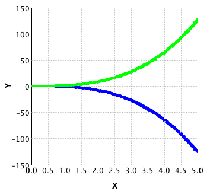
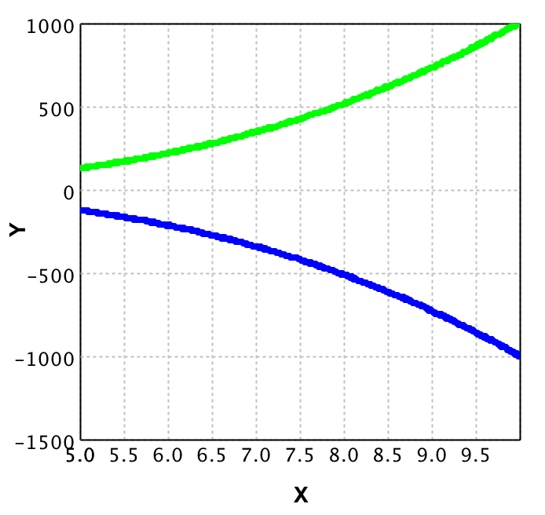

Given the base code at the start of this practical example we do the following replacements:

```scala
val trainingPath = "/users/.../Example Data/SVM_Example_2.csv"
val testingPath = "/users/.../Example Data/SVM_Example_2_Test_data.csv"

```

If we then run the code to see the performance with the gaussian kernel we get the following results:

| c, s-> | 0.01 | 0.1 | 0.2 | 0.5 | 1.0 | 2.0 | 3.0 | 10.0 | 100.0 |
| :-- | :--: | :--: | :--: | :--: | :--: | :--: | :--: | :--: | :--: | 
| **0.001** | 50% | 50% | 50% | 50% | 50% | 50% | 50% | 50% | 50% |
| **0.01** | 50% | 50% | 50% | 50% | 50% | 50% | 50% | 50% | 39.8% |
| **0.1** | 50% | 50% | 50% | 50% | 50% | 49.4% | 49.1% | 47.5% | 35.4% |
| **0.2** | 50% | 50% | 50% | 50% | 49.4% | 49.2% | 48.8% | 47.1% | 34.3% |
| **0.5** | 50% | 49.9% | 49.8% | 49.5% | 49.3% | 48.9% | 48.6% | 46.8% | 33.1% |
| **1.0** | 50% | 49.8% | 49.7% | 49.4% | 49.4% | 48.9% | 48.6% | 46.2% | 50% |
| **2.0** | 50% | 49.8% | 49.7% | 49.4% | 49.3% | 49.2% | 48.8% | 45.7% | 31.7% |
| **3.0** | 50% | 49.8% | 49.7% | 49.8% | 49.5% | 49% | 48.8% | 46.2% | 27.4% |
| **10.0** | 50% | 49.8% | 49.7% | 49.4% | 49.3% | 49% | 48.4% | 46.7% | 33.2% |
| **100.0** | 50% | 49.8% | 49.7% | 49.4% | 49.3% | 49.1% | 48.6% | 46.7% | 32.2% |

We see that even in the best case, still 27.4% of the testing data is falsely classified. This is interesting as when we look at the plots, a very clear distinction can be found between both classes. We could fine tune the sigma and correction rate, but when prediction points very far away (say x is 100000) the sigma and correction rate would be way to high for it to do a good performance (time wise and prediction wise).

So let's change the kernel from gaussian to a polynomial one as follows

```scala

 val svm = new SVM[Array[Double]](new PolynomialKernel(2), 1.0,2)
 
```
Note how we pass 2 in the constructor of the ```PolynomialKernel```. This 2 represents the degree of the function it tries to fit on. If we perform the runs not only for degree 2, but for degrees of 2,3,4,5 and for the correction rates differing again from 0.001 up to 100, we get the following results:

| | degree: 2 | degree: 3 | degree: 4 | degree: 5 |
| :-- | :--: | :--: | :--: | :--: | :--: | :--: | :--: | 
| **c: 0.001** | 49.7% | 0% | 49.8% | 0% |
| **c: 0.01** | 49.8% | 0% | 49.8% | 0% |
| **c: 0.1** | 49.8% | 0% | 49.8% | 0% |
| **c: 0.2** | 49.8% | 0% | 49.8% | 0% |
| **c: 0.5** | 49.8% | 0% | 50% | 0% |
| **c: 1.0** | 49.9% | 0% | 50% | 0% |
| **c: 2.0** | 50% | 0% | 47.9% | 0% |
| **c: 3.0** | 38.4% | 0% | 50% | 0% |
| **c: 10.0** | 49.5% | 0% | 49.5% | 0% |
| **c: 100.0** | 49.5% | 0% | 49.5% | 0% |

Here we see that the testing data, which did not contain 1 single overlapping point with the training data, gets 100% accuracy for degrees 3 and 5. This is an amazing performance in comparison to the gaussian kernel with 27.4% in its best case. Do note that this example data is constructed, thus did not contain a lot of noise. This is why the error rate is 0% for all 'correction rates'. If you would add noise, fine-tuning of this correction rate would be needed.

This concludes the section on Support Vector machines. 

#Conclusion

After reading the global idea of machine learning you should be able to identify your case as a [classification](#classification), [regression](#regression) or [dimension reduction](#principal-components-analysis-pca) problem. Additionally you should understand the basic concept of machine learning, what a [model](#model) is, and you should be aware of some of the [common pitfalls](#common-pitfalls) in machine learning.


After working through the practical examples on this blog you should be able to use [K-NN](#labeling-isps-based-on-their-downupload-speed-k-nn-using-smile-in-scala), [Naive Bayes](#classifying-email-as-spam-or-ham-naive-bayes), and [linear regression](#predicting-weight-based-on-height-using-ordinary-least-squares). Additionally you should be able to perform [text regression](#an-attempt-at-rank-prediction-for-top-selling-books-using-text-regression), merge features using [PCA](#using-unsupervised-learning-to-merge-features-pca) and use [Support Vector Machines](#using-support-vector-machines-svms), and last but not least build your own [recommendation system](#ranking-emails-based-on-their-content-recommendation-system).

In case you have questions or feedback regarding this blog, feel free to contact me via [Github](https://github.com/Xyclade), [LinkedIn](https://www.linkedin.com/profile/public-profile-settings?trk=prof-edit-edit-public_profile) or [Twitter](https://twitter.com/Mikedewaard).


